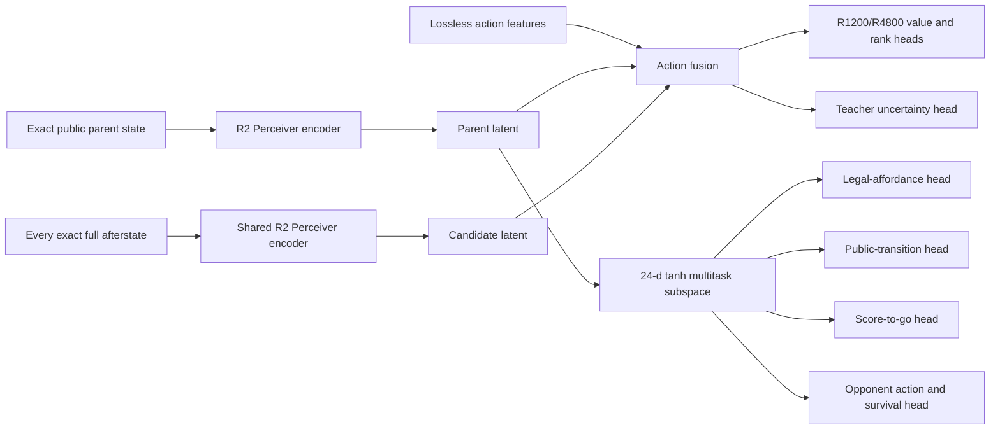

# R2 Multitask Action Perceiver Implementation Plan

Date: 2026-06-17

Status: scoped implementation plan; no training or protected-data access authorized

> **Expert-iteration update (2026-06-18):** The architecture contract in this
> document remains the basis for R2-MAP. Its oracle-training dataset, four-host
> topology, gameplay ordering, and checkpoint-loop sections are superseded by
> [`R2_MAP_EXPERT_ITERATION_RESEARCH_PLAN.md`](R2_MAP_EXPERT_ITERATION_RESEARCH_PLAN.md),
> which freezes the 100,000-game greedy bootstrap, three-Mac 45-minute
> generation windows, John1-only MLX training, John2/John3 benchmark overlap,
> and post-reference no-pruning performance program.

Working name: `r2-map-v1` (R2 Multitask Action Perceiver)

## Executive decision

Build one primary architecture family:

> A widened exact-R2 fixed-latent Perceiver that scores complete actions from
> full exact afterstates, with the existing graded-oracle action-value and
> uncertainty objectives as primary heads and a small, gradient-protected
> multitask subspace for legal-affordance, public-transition, score-to-go, and
> opponent-action/survival supervision.

This supersedes the simpler idea of making a 1024-wide legacy NNUE the primary
model. The legacy NNUE remains a cheap control and possible retrieval sidecar,
but V2 evidence selects exact sparse R2 plus Perceiver latents as the stronger
research substrate.

The first implementation does **not** add a large opponent-market
cross-attention graph, a candidate-set transformer, a hierarchical pointer, a
new search algorithm, or a low-rank adapter. Those mechanisms either failed
locally or add an unneeded variable before the representation itself is
qualified.

## Claim boundary

This plan is not evidence of progress toward 100. It authorizes no model,
protected validation, sealed test, gameplay, or score claim. Promotion remains
subject to the existing V2 gates and an untouched 1,000-game final-domain run.

## Why this architecture

### Local evidence

| Evidence | Result | Consequence |
|---|---|---|
| Canonical qualified player | 95.744 mean, 95% CI `[95.652, 95.837]` | The measured gap is 4.256 points; small offline improvements are insufficient. |
| R2 architecture tournament | Fixed-latent Perceiver was the only arm passing all value-noninferiority gates; 10,178.87 afterstates/s, 6.213 ms P50, 121.8 MB peak active memory | Preserve this trunk. Do not reopen Set Transformer or directional graph trunks without new evidence. |
| Full-R2 action control | R4800 MAE 1.32023, RMSE 1.74231, top-64 winner recall 72.50%, retained regret 0.09812, confidence-set coverage 97.92%, 86,208 scores/s, 130.95 ms decision P99 | This is the baseline to beat and the candidate representation to retain. |
| R3 compact action edits | Every radius treatment degraded value quality and none improved efficiency | Do not replace full exact afterstates with compact action patches. |
| S4 candidate context | Exact relations produced a small signal but failed confidence, protected slices, and serving envelopes | Do not add sibling/candidate-set attention in v1. |
| Relational and opportunity cross-attention | No arm advanced; serving exceeded 250 ms and treatments exceeded 4 GiB RSS | Avoid a large graph/cross-attention branch. |
| P1 hierarchical pointer | Tile-stage recall 48.51%; integrated top-64 recall 9.82% | Keep exhaustive/full-afterstate ranking as the first policy path. |
| V1 score anatomy | Improved MAE but regressed correlation, pairwise accuracy, and pairwise log loss | Auxiliary targets may not override the ranking objective. |
| O1 opponent model | Policy-held-out Brier improved 1.959% and sealed Brier 1.824% | Opponent prediction is a valid auxiliary target. |
| O1 direct ranking integration | Retained-regret improvement only 0.009142; interval touched zero | Do not directly fuse frozen opponent probabilities into action logits in v1. |
| S9 multitask probe | Held-game teacher RMSE improved 3.2218%; winner accuracy was noninferior; all slices passed | Multitask representation learning is the strongest unmaterialized architecture signal. |
| F5 corrected tail | Held-out MSE improved 1.982% and 1.868%; all 301 rows had stable nonzero gradients | Preserve exact supply/overflow information and audit that the model uses it. |
| L5 trust region | One held-blind 0.10-point step improved median loss 0.9507% in 8/8 folds | Use bounded output movement for later fine-tuning, not as the initial architecture. |
| T5 restricted bound | Safely pruned 74.46% of actions with zero violations in its narrow domain | Retain as an optional domain-gated serving optimization after model qualification. |
| T1 search horizon | Every searched arm was worse than direct exact-R2 ranking | Search stays closed until the direct policy/value model improves. |

### Research basis

- [Perceiver](https://arxiv.org/abs/2103.03206) uses asymmetric attention to
  distill variable, high-dimensional inputs into a fixed latent bottleneck.
  This matches the measured R2 result and its variable exact-token input.
- [Perceiver IO](https://arxiv.org/abs/2107.14795) adds output queries with
  different semantics. It supports sharing one state representation across
  action-value, uncertainty, and auxiliary prediction heads.
- [Decision-Focused Learning Through the Lens of Learning to Rank](https://proceedings.mlr.press/v162/mandi22a.html)
  treats decision learning as ranking feasible alternatives. This supports
  retaining listwise and regret-centered action objectives rather than
  optimizing scalar value error alone.
- [Gradient Surgery for Multi-Task Learning](https://proceedings.neurips.cc/paper_files/paper/2020/hash/3fe78a8acf5fda99de95303940a2420c-Abstract.html)
  identifies destructive gradient interference and projects conflicting task
  gradients. The V1 anatomy failure makes this directly relevant.
- [Accelerating Self-Play Learning in Go](https://arxiv.org/abs/1902.10565)
  shows that game-specific auxiliary targets can materially improve data
  efficiency, but the local V1 result requires primary-task guardrails.
- [Agent Modeling as Auxiliary Task for Deep Reinforcement Learning](https://arxiv.org/abs/1907.09597)
  motivates learning opponent policies as auxiliary representation targets.
  Local O1 evidence supports prediction but rejects direct residual fusion.
- [DCN V2](https://arxiv.org/abs/2008.13535) provides a cost-controlled way
  to learn low-rank feature interactions. A single low-rank opponent-market
  cross block is reserved as a later ablation, not part of the base model.
- [AlphaStar](https://www.nature.com/articles/s41586-019-1724-z) supports
  diverse opponent populations for robust multi-agent learning. It motivates
  later policy-held-out/PFSP data, not a larger v1 architecture.

## Target model

### High-level dataflow



### Exact input contract

Reuse existing authoritative records; do not invent another public-state
schema in the first experiment.

- Parent and candidates use exact sparse R2 occupied/frontier/component/motif
  tokens generated by Rust.
- Candidate scoring uses full exact afterstates. No radius crop or quotient is
  allowed.
- Lossless 140-dimensional complete-action features remain available to the
  action head.
- Public supply and overflow fields are retained and activation-audited.
- Boards remain relative-seat ordered.
- D6 state/action transforms remain owned by Rust and are bijectively tested.
- Hidden order, future refill, policy ID, game ID, host identity, and split
  identity are forbidden model inputs.

### Trunk configuration

Create a new versioned config rather than weakening the frozen R2 v1
validator.

| Field | `r2-map-v1` value | Reason |
|---|---:|---|
| `hidden_dim` | 192 | Existing V2 reference envelope; expected to put the model near the 4-8M parameter target. |
| attention heads | 4 | Isolates width from the accepted four-head topology. |
| board latents | 16 | Preserve the selected latent bottleneck before testing latent-count changes. |
| board latent blocks | 1 | Preserve topology; capacity is the first independent variable. |
| cross-board blocks | 1 | Preserve explicit global, market, and four-player interaction. |
| feed-forward multiplier | 2 | Preserve accepted topology. |
| precision | float32 reference | Lower precision requires a separate parity gate. |
| D6 | deterministic uniform schedule over all 12 transforms | Reuse the accepted contract. |

The implementation must report the exact parameter count. If it falls outside
4-8M, adjust only the feed-forward width in a preregistered mechanical sizing
step before training; do not tune on metrics.

### Primary action heads

Start from the accepted full-R2 `c0-full-r2-afterstate` ranker and preserve its
primary semantics:

- R1200 centered value;
- R4800 centered value;
- listwise action distribution;
- stable-winner classification; and
- teacher standard-error calibration.

The candidate fusion surface receives:

```text
parent latent
candidate-afterstate latent
candidate minus parent
candidate elementwise parent
lossless complete-action features
```

It does not receive a learned opponent-probability residual or sibling
attention in v1. The main score is a complete-action ranking score, not a
terminal scalar value repurposed after training.

### Multitask subspace

Add one `192 -> 24 -> tanh` projection from the shared state representation.
Attach the four non-teacher S9 families exactly as previously accepted:

1. current/future legal affordance from
   `o3-explicit-public-action-record-v1`;
2. public transition from the same terminal-complete public record;
3. signed score-to-go components from
   `signed-score-to-go-components-v1`; and
4. ordered opponent next action plus four-tile survival from
   `three-opponent-next-action-four-tile-survival-v1`.

The fifth S9 family is the primary graded-oracle action value/uncertainty task.
The auxiliary heads are training-only. Serving emits only action scores,
uncertainty, and explicitly requested calibrated diagnostics.

Do not add V1's full score-anatomy head as an independent fifth auxiliary in
the first treatment; that objective already showed ranking interference.

### Gradient routing

Primary action-ranking gradients are authoritative.

1. Compute the primary gradient and each active auxiliary gradient separately.
2. Log cosine similarity and norm by trunk module.
3. If an auxiliary gradient has negative dot product with the primary
   gradient, project only the auxiliary gradient onto the primary gradient's
   normal plane.
4. Never modify the primary gradient.
5. Sum the protected auxiliary gradients with the primary gradient.
6. Use a deterministic fixed task order.

Loss scales are calibrated from train-only initialization gradients and then
frozen. A falling aggregate loss cannot compensate for worse primary ranking
metrics.

### Primary loss

Preserve the accepted C0 loss for the capacity experiment:

```text
R1200 Huber
+ 4 * R4800 Huber
+ 0.5 * R1200 listwise loss
+ R4800 stable-winner loss
+ 0.1 * standard-error calibration
+ 0.01 * screen-only regularization
```

Only the later multitask treatment adds projected auxiliary gradients. This
keeps capacity and supervision as separate causal questions.

## Explicit non-goals

The first implementation must not include:

- Set Transformer or directional graph trunk arms;
- R3 radius action patches or R5 quotient states;
- candidate-to-candidate attention;
- hierarchical pointer retrieval;
- direct O1 probability-vector residual fusion;
- learned demand-supply matching;
- plan slots or a learned transition model;
- cross-turn MCTS reuse;
- a full low-rank opponent-market cross network;
- LoRA/adapters on an unqualified base model;
- float16/bfloat16/quantized serving; or
- any new gameplay/search hyperparameter.

## Dataset and split contract

### Referenced datasets

Use reference-only views; do not physically merge or fan out large corpora.

| Purpose | Existing source |
|---|---|
| Primary graded teacher | Eight compatible open-train graded-oracle game blocks, including the accepted seed-61111 replacement |
| Exact R2 representation | Accepted R2 sparse cache/export contract |
| Legal and public transition auxiliaries | Terminal-complete explicit public-action records used by S9 |
| Score-to-go auxiliary | Accepted score-to-go H6 train shards |
| Opponent action/survival auxiliary | Accepted policy-held-out O1 train corpus |
| Protected validation | Existing complete-action graded-oracle validation identity; rows remain unopened until a candidate hash is centrally registered |

### Split rules

- All model-selection work uses whole-game open-train folds.
- Eight-fold leave-one-teacher-game-out is the scientific comparison.
- Auxiliary residues are game-block disjoint from each held teacher game.
- Group identity is `(game, turn, focal seat, action identity)`, not globally
  unique `TurnAction` hash; O2 proved that the latter legitimately repeats.
- Normalization statistics are fit on the training portion of each fold only.
- No validation-guided early stopping or architecture tuning.
- One final all-eight-block materialization rule is frozen before the first
  full treatment run.

## Materialization contract — required before fitting

This gate exists because S9 and L5 produced positive local signals but no
deployable candidate.

Before any treatment optimizer step, implement and test:

1. a versioned model config and tensor-name/shape manifest;
2. a deterministic all-eight-block final-fit rule;
3. an exact matched-control materializer;
4. atomic `safetensors`, optimizer, and cursor checkpoints;
5. resume that rejects source, data, config, or schedule drift;
6. a loader/inference protocol with schema and model hashes;
7. fixed prediction and D6 panels;
8. a standalone verifier that does not import the trainer;
9. byte-exact rerun of the verifier on a second host; and
10. central registration of candidate and control hashes before any protected
    row is opened.

Failure of this gate stops the architecture before expensive training.

## Experimental funnel

Each stage has one control and one treatment. A failed stage closes its branch;
later stages do not run automatically.

### Stage 0 — contracts and bounded smoke

Deliverables:

- new config, model, trainer, checkpoint writer, loader, and verifier;
- synthetic and 32-group real-data smoke;
- exact finite outputs and gradients;
- one-step save/reload/resume parity;
- deterministic D6 prediction permutation/invariance panel;
- 100-step resource extrapolation.

Hard gates:

- zero identity, mask, padding, legality, D6, or action-mapping failures;
- byte-identical deterministic rerun;
- projected full run at most eight hours on one Mac;
- peak process RSS at most 4 GiB and zero swap growth;
- projected new disk use at most 40 GiB per host.

### Stage 1 — reproduce the accepted C0

Load the existing width-64 full-R2 afterstate checkpoint and reproduce its
stored fixed prediction panel, tensor identity, and open-train report within
the frozen numerical tolerance. Then rerun the control only through the new
eight-fold open-train harness. Do not reopen validation rows at this stage.

Historical validation context, not a new Stage 1 evaluation:

- R4800 MAE 1.32023;
- R4800 RMSE 1.74231;
- top-64 stable-winner recall 72.50%;
- retained regret 0.09812;
- confidence-set coverage 97.92%;
- complete-decision P99 130.95 ms.

Any unexplained identity or prediction drift blocks every treatment. The new
held-game C0 measurements become the matched Stage 2 baseline; the historical
validation numbers are not used to tune thresholds or checkpoints.

### Stage 2 — capacity-only treatment

Compare:

- `C0`: accepted width-64 architecture;
- `C1`: width 192, otherwise identical topology, targets, loss, data order,
  optimizer family, seed policy, and training exposure.

Train from scratch. Do not warm-start the wider model. Use the accepted C0
schedule as the initial reference; any step-count increase must be frozen by
train-only loss saturation before fold evaluation.

Advance only if C1 satisfies all on the eight open-train held-game folds:

- paired held-game retained-regret interval wholly below zero;
- mean top-64 retained regret improves by at least 0.01 absolute and 10%
  relative versus the new C0 measurement;
- stable-winner top-64 recall improves by at least five percentage points;
- confidence-set coverage improves by at least one percentage point or
  reaches 99%;
- R4800 MAE and RMSE no worse than C0 by more than 0.02 and 0.03;
- no protected phase, low-supply, independent-draft, legal-width, or wildlife
  slice regression beyond its preregistered tolerance;
- at least 20,000 action scores/s, with 40,000 as the engineering target;
- complete-decision P99 at most 200 ms;
- peak active memory at most 2 GiB, process RSS at most 4 GiB, zero swap.

The thresholds are intentionally material. A width increase that merely fits
the same plateau is not a path to four additional points.

### Stage 3 — S9 multitask treatment

Compare the selected capacity model with and without the exact 24-dimensional
multitask subspace and gradient protection.

Advance only if the multitask treatment satisfies all:

- macro held-game teacher RMSE at least 2% below the capacity control;
- winner accuracy no more than 0.02 below control;
- no protected slice with at least 32 candidates has RMSE more than 5% above
  control;
- main retained regret improves by at least 0.005 or top-64 winner recall
  improves by at least one percentage point;
- no main MAE, RMSE, pairwise, confidence, or resource guardrail regression;
- deterministic rerun is byte-identical.

If auxiliary metrics improve but primary action ranking does not, keep the
heads as diagnostics and do not ship them in the candidate.

### Stage 4 — optional low-rank opponent-market cross

This stage is conditional, not part of the base implementation. Run it only if
the Stage 3 failure atlas shows residual error concentrated in contested-market
states and the auxiliary opponent head is calibrated.

Implement at most one low-rank interaction block over the 12 public
opponent-market pairs. Freeze rank 32 and one cross layer before training.
Do not introduce general candidate-to-state cross-attention.

Advance only with:

- global retained-regret improvement at least 0.01;
- contested-market retained-regret improvement at least 0.03;
- paired game-bootstrap intervals wholly below zero;
- no low-supply, independent-draft, or wildlife-family harm;
- less than 10% P99 latency increase and less than 256 MiB RSS increase.

This gate is stricter than O1's observed 0.009142 directional effect.

### Stage 5 — candidate materialization and independent verification

Materialize exactly one candidate and one matched control from all eight open
train blocks using the pre-frozen rule. Candidate files remain on their origin
host. A different host receives only the compact manifest, verifier, fixed
prediction panel, and immutable source receipt.

The independent verifier must confirm:

- complete tensor layout and hashes;
- config, source, dataset, and training-schedule identities;
- save/load and resume identity;
- fixed prediction panel;
- D6 state/action behavior;
- primary and auxiliary head dimensions;
- no forbidden feature channels; and
- serving protocol parity.

### Stage 6 — one protected validation opening

After central registration, evaluate the selected checkpoint once on the
existing protected complete-action graded-oracle validation corpus.

Required minimums:

- proposal target recall above 98%;
- R4800 winner retention above 98% for the deployed frontier;
- top-64 confidence-set coverage at least 99%;
- retained R4800 regret below 0.15 and below the matched control with a paired
  interval wholly below zero;
- no phase, Nature Token, independent-draft, legal-width, low-supply, or
  wildlife-family floor failure;
- deterministic independent replay;
- serving and zero-swap gates pass.

If validation fails, test and gameplay remain closed. Do not tune against the
opened validation set.

### Stage 7 — serving integration

Only a protected-validation pass authorizes product integration.

Add a grouped complete-action inference message to
`crates/cascadia-model/src/lib.rs` that carries one exact parent plus all legal
full afterstates/action identities and returns scores plus standard errors.
Batch by legal-set size; do not dispatch one candidate per MLX call.

Integrate the predictor into `crates/cascadia-search` as a direct complete-
action selector first. Existing search stays off. Verify:

- exact action hashes and legality;
- no candidate omission or reordering;
- deterministic selected action under identical seeds;
- MLX process shutdown and restart;
- maximum legal-width memory;
- current CLI, API, and web behavior.

The T5 bound may be added later only under its exact narrow domain predicate.
It may not prune unsupported states.

### Stage 8 — gameplay and final qualification

1. Equal-budget 20-game operational smoke; no strength claim.
2. Paired 100-game pilot requiring at least +0.50 mean and all score-anatomy
   guardrails.
3. Paired 500-game confirmation requiring a positive 95% paired interval and
   a practically material gain.
4. Before final-domain opening, development mean should reach 100.25-100.50
   over at least 500 fresh games.
5. One untouched 1,000-game final-domain run with the same frozen policy in
   all four seats. Success requires mean base score at least 100.000; a lower
   95% confidence bound above 100 is preferred.

Search, league training, adapters, and tree reuse remain separate successor
experiments. They may begin only after the direct model has a qualified
gameplay gain.

## Implementation map

### New Python modules

| File | Responsibility |
|---|---|
| `python/cascadia_mlx/r2_map_model.py` | Versioned width-192 Perceiver, full-afterstate action heads, 24-d multitask projection, auxiliary heads |
| `python/cascadia_mlx/r2_map_dataset.py` | Reference-only grouped primary and auxiliary loaders with whole-game folds |
| `python/cascadia_mlx/r2_map_train.py` | Fixed schedules, asymmetric gradient projection, atomic checkpoint/resume |
| `python/cascadia_mlx/r2_map_evaluate.py` | Fold and protected metrics, slices, bootstrap intervals, failure atlas |
| `python/cascadia_mlx/r2_map_verify.py` | Trainer-independent artifact and fixed-panel verifier |
| `python/cascadia_mlx/r2_map_serve.py` | Long-lived grouped complete-action MLX service |
| `python/cascadia_mlx/r2_map_promote.py` | Fail-closed promotion manifest creation after all gates |

### Existing Python modules to reuse, not duplicate

- `r2_sparse_mlx_model.py`: accepted token adapters and Perceiver primitives;
- `r3_action_edit_mlx_model.py`: exact full-R2 control and primary head/loss
  semantics;
- `r3_action_edit_mlx_cache.py`: accepted full-afterstate grouped cache;
- `graded_oracle_dataset.py`: lossless action and teacher records;
- `score_to_go_dataset.py`: signed score-to-go auxiliary;
- `opponent_intent_dataset.py`: policy-held-out opponent/survival auxiliary.

### Rust changes after protected validation only

| File | Change |
|---|---|
| `crates/cascadia-model/src/lib.rs` | Add versioned grouped complete-action request/response frames |
| `crates/cascadia-search/src/ranking_prediction.rs` | Preserve grouped action identity and validate response cardinality |
| `crates/cascadia-search/src/` new direct selector | Enumerate every legal action, batch exact afterstates, select deterministically |
| `crates/cascadia-cli-v2/src/` | Add explicit model path/config flags and diagnostic command |
| `pyproject.toml` | Register train/evaluate/verify/serve entry points |

Do not change legacy NNUE feature indexing as part of this implementation.

## Test plan

### Unit tests

- v1 R2 model remains byte-compatible and rejects v2 configs;
- v2 config validates exact dimensions and parameter envelope;
- padding is inert for every token type and market row;
- state encode count and candidate cardinality are exact;
- full afterstate/action hashes remain aligned after batching and D6;
- the 24-d subspace exposes only public inputs;
- each auxiliary head has exact target shape and finite loss;
- asymmetric gradient projection never modifies the primary gradient;
- negative auxiliary dot products become nonnegative after projection;
- positive auxiliary gradients are unchanged;
- checkpoint save/load and resumed next batch are byte-identical;
- verifier rejects one-byte tensor, config, source, or dataset drift;
- grouped service rejects partial, duplicate, or reordered responses.

### Property and integration tests

- all 12 D6 transforms round-trip state and action identities;
- scalar and uncertainty outputs are invariant; policy outputs permute;
- hidden-state and future-order perturbations cannot change inputs or scores;
- all legal actions are scored exactly once at maximum observed width;
- same seed/config/data produces a byte-identical scientific report;
- independent host verifier reproduces the fixed panel;
- zero swap growth during maximum-width train and serve probes;
- CLI/API/web integration preserves legal actions and shutdown behavior.

### Regression tests

- reproduce the accepted C0 prediction panel and terminal metrics;
- reproduce S9's two-arm tiny probe before embedding its auxiliary contracts;
- reproduce O1 A2 auxiliary calibration without enabling direct fusion;
- verify the F5 supply/overflow channels activate on the accepted witnesses;
- verify unsupported T5 states never enter the exact-pruning path.

## Four-Mac execution topology

The orchestrator remains control-plane only. Each host has one resident owner
and keeps its experiment local from implementation through classification.

### Wave 1 — independent prerequisites

| Host | Owner task |
|---|---|
| john1 | Reproduce C0 and build the independent artifact verifier |
| john2 | Implement and smoke the width-192 capacity-only model |
| john3 | Build reference-only multitask dataset adapters and leakage tests |
| john4 | Implement gradient projection and maximum-width resource benchmark |

These tasks share only an immutable contract receipt. No mutable cache or
checkpoint is synchronized.

### Wave 2 — gated treatments

- Capacity-only scientific run stays on john2.
- Multitask treatment materializes on a different origin host only after the
  capacity gate passes.
- One independent verifier runs on a different host from the selected
  candidate.
- Other hosts continue independent tests/profiling; they do not replay the
  same training merely to remain busy.

### Qualification

Only after the candidate is fully frozen may gameplay seeds be sharded across
hosts. Seeds are disjoint, outputs are atomic, and only compact manifests are
centralized. No host waits on an all-host barrier during discovery.

## Storage and resource plan

Storage location is superseded by ADR 0195. All new canonical artifacts live
on John2's internal APFS volume under:

```text
john2:/Users/john2/cascadia-bench/r2-map-v1/
```

Do not write `/Volumes/John_1`; its prior R2-MAP tree is read-only legacy
evidence. Use these subdirectories beneath the John2 root:

```text
control/
cache/
checkpoints/
runs/
reports/
tmp/
```

Current reference sizes:

- R3/full-R2 experiment tree: approximately 11 GiB;
- graded-oracle train: approximately 457 MiB;
- graded-oracle validation: approximately 184 MiB;
- O1 corpus: approximately 164 MiB;
- R2 tournament: approximately 1.5 GiB.

Budget at most 80 GiB for canonical `r2-map-v1` caches, checkpoints, reports,
and temporary files on John2, with a 40 GiB per-arm hard gate and a 100-GiB
free-space floor.
John1 trains from verified in-memory windows and publishes directly to John2;
it has no training staging path. Its only runtime staging is the ADR 0195
generation exception: one signed/hash-verified executable plus <=64-KiB
manifest in registered `/private/tmp`, <=64 MiB combined, removed with a
verified cleanup receipt. Other host-local execution copies are bounded,
non-authoritative, and removed after their hash-identical John2 artifact is
verified.

The accepted width-64 C0 needed about 3,344 seconds for 3,000 steps. Width 192
is expected to cost several times more; the 100-step smoke must measure rather
than assume the factor. Abort any full arm projected above eight hours or 4 GiB
RSS.

## Decision tree

```text
materialization contract fails -> stop
C0 does not reproduce -> stop and repair provenance
capacity treatment fails -> close width scaling; do not add auxiliaries
capacity passes, multitask fails -> keep capacity model only
multitask passes -> materialize one candidate
contested-market residual remains material -> optional one-block cross test
protected validation fails -> close before gameplay
100-game gain < +0.50 -> close before confirmation
500-game interval not positive -> no final-domain run
development mean < 100.25 -> do not open final domain
final mean >= 100.000 -> goal reached
```

## Deferred fallback: widened legacy NNUE

The repository already contains gated opponent-market features in
`legacy/crates/cascadia-ai/src/nnue.rs`, including `oppmarket-feat` and the
larger `czero` opponent-market block. Do not build another parallel feature
system.

A 1024-wide legacy NNUE from scratch is a fallback only if the R2 capacity arm
is blocked by serving cost rather than quality. Any fallback must use the
corrected schema, exact tail activation, and a separately preregistered
from-scratch learning rate. It may not warm-start at the known-divergent
`1e-4` rate or claim equivalence to the R2 model.

## Completion criteria for the implementation phase

The implementation phase is complete when:

- Stage 0 contracts and tests pass;
- C0 reproduces;
- the capacity and, if authorized, multitask experiments have terminal
  classifications;
- every candidate/control artifact is serializable, reloadable, resumable,
  and independently verifiable;
- the dashboard and durable experiment ledger contain exact identities and
  terminal outcomes;
- no protected data or gameplay was opened without its preceding gate; and
- the next authorized action is unambiguous: protected validation, a bounded
  optional cross ablation, or terminal closure.
