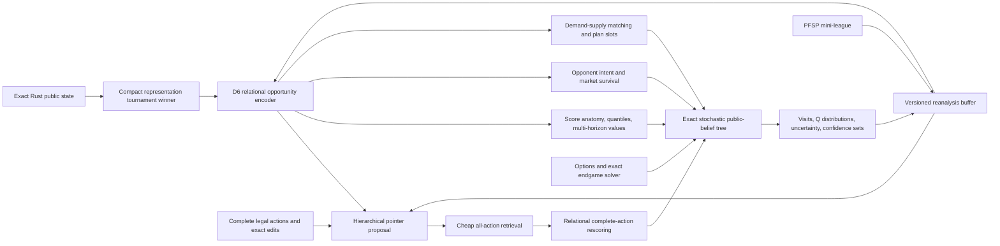
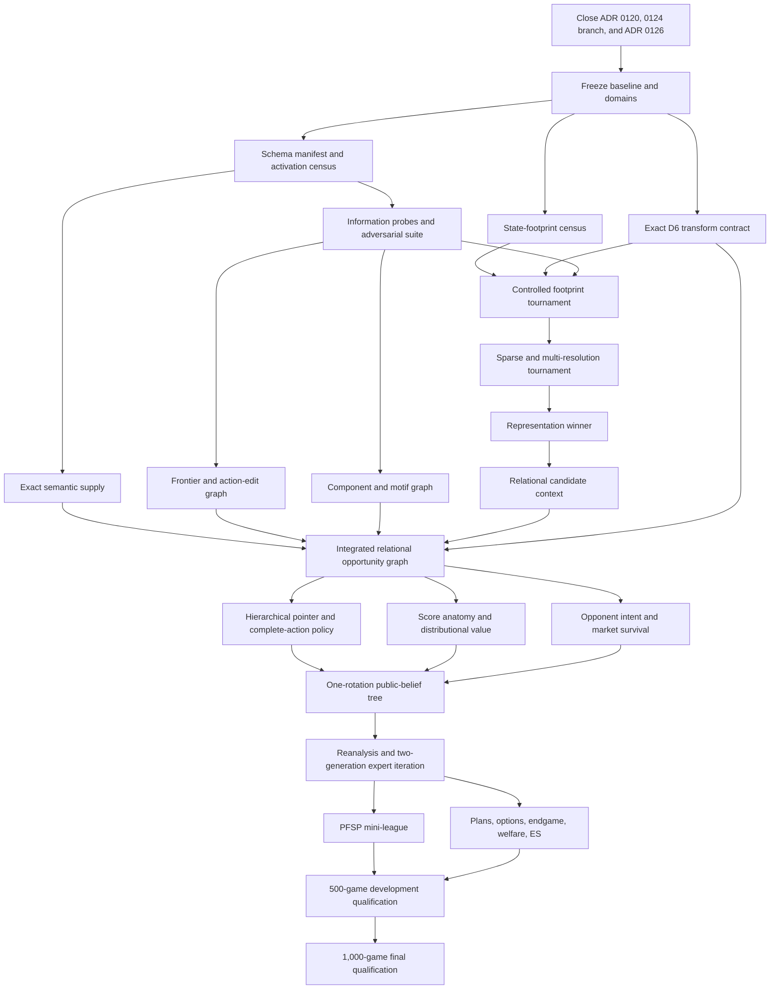

# Cascadia Research Implementation Plan To 100

Status: active execution program

Date: 2026-06-16

Ruleset: four-player AAAAA, no habitat bonuses

Primary target: at least 100.000 mean base score under the canonical benchmark

Compute boundary: john1, john2, john3, and john4 only; no external compute

Neural boundary: MLX for all Apple neural training and inference

This document turns the following research reports into one executable program:

- [State-of-the-art research directions](reports/state-of-the-art-research-directions-2026-06-16.md)
- [Feature representation audit](reports/feature-representation-audit-2026-06-16.md)

It supplements the current [Plan To 100](PLAN_TO_100.md), preserves the
existing experimental and provenance discipline, and defines the next
generation of representation, policy, value, search, and continual-learning
work. It does not retroactively reinterpret any completed ADR.

## Executive Decision

The current qualified player scores **95.744** over 1,000 held-out games and
4,000 seats, with a game-block 95% confidence interval of
`[95.652, 95.837]`. The measured gap is **4.256 points**.

The route to 100 is not another pointwise ranker, another hand-written feature
pile, or a generic increase in rollout count. The program will build and
falsify an integrated system:

> **CascadiaZero: a compact relational complete-action policy and decomposed
> value model, improved by exact stochastic public-belief search, continual
> reanalysis, and opponent-population self-play.**

The first mandatory decision is the state representation. The current
441-cell dense lattice is almost certainly wasteful, but the repository does
not support the specific claim that 121 cells is the established optimum.
The verified historical evidence, originally measured over 50,000 legacy
self-play states and recorded in the
[V6 bounded-design note](../../legacy/research/overnight/v6_bounded_design.md),
is:

| Centered hex region | Cells | Historical per-cell firing coverage |
|---|---:|---:|
| Radius 3 | 37 | 92.3% |
| Radius 4 | 61 | 98.3% |
| Radius 5 | 91 | 99.7% |
| Radius 6 | 127 | 99.9% |
| Full 21 x 21 lattice | 441 | 100% by construction |

A complete centered radius-`r` hex disk contains `1 + 3r(r + 1)` cells, so a
radius-6 disk contains 127 cells and a radius-5 disk contains 91. There is no
complete centered hex disk with exactly 121 cells. If 121 was used in an
older private experiment, it was an irregular crop or a different indexing
scheme; no repository artifact currently verifies it.

The legacy radius-6 V6 system later ran a 50-game parity benchmark in 1,908
seconds versus 3,442 seconds for the prior V4 system, a **1.80x wall-time
improvement**. It scored 95.20 versus 95.80 in that benchmark and trailed by
0.31 in a small cross-binary head-to-head, as recorded in the
[April 20 overnight report](../../legacy/docs/OVERNIGHT_REPORT_apr20.md).
That result is informative but not causal: V6 changed the footprint, feature
layout, feature content, training path, and total model shape together. It
proves that compact spatial indexing is plausible leverage. It does not prove
that 127 cells is strength-neutral.

The plan therefore starts with a controlled representation tournament:

1. 441-cell dense control;
2. 127-cell radius-6 dense disk with an exact overflow summary;
3. 91-cell radius-5 dense disk with an exact overflow summary;
4. sparse occupied-plus-frontier entity representation;
5. action-centric local geometry plus global component and motif tokens;
6. adaptive multi-resolution and quotient-state variants.

The winning representation is selected by information preservation,
decision quality, MLX throughput, memory, and paired gameplay. Speed alone
does not promote it, and no arm may silently discard out-of-region state.

## Definition Of Done

The program succeeds only when one frozen player satisfies all of the
following:

- four-player AAAAA rules with habitat bonuses disabled;
- the same frozen policy occupies all four seats;
- one untouched 1,000-game final-domain run;
- mean base score of at least **100.000**;
- ideally, a game-block 95% confidence interval whose lower bound exceeds 100;
- no hidden-state leakage or use of future tile order;
- exact public bag and supply beliefs use only legally observable information;
- Rust owns rules, legality, scoring, simulation, chance construction,
  apply/undo, public-state hashing, and search bookkeeping;
- MLX owns all Apple neural training and inference;
- every promoted artifact is reproducible locally from checksummed manifests;
- the player remains available through CLI, API, and the interactive web tool.

Before opening the final domain, the development player should score
**100.25 to 100.50** over at least 500 fresh games. This buffer is a risk
control, not a revised goal.

## Program Thesis

The remaining points are expected to come from representing and planning over
**opportunities, competition, and commitments**:

- an empty frontier cell as a set of component and motif transitions;
- a tile as exact terrain, edge, wildlife, and supply semantics rather than an
  arbitrary scalar ID;
- an unseen bag as a distribution over joint semantic archetypes rather than
  independent marginals;
- a market pair as a contested object with a survival window;
- an opponent board as a source of resource demand and future action
  probabilities;
- a plan as a match between unfinished scoring structures and stochastic
  future supply;
- a complete action as an exact edit to the opportunity graph;
- search as a policy-improvement operator whose full distribution is learned,
  not a disposable argmax oracle.

The largest historical step gain came from richer opponent information. The
largest current measured loss is proposal-frontier regret. The teacher's
winner is statistically distinguishable in only 18.359% of validation
decisions, with an average 95% confidence set of 10.140 actions. These facts
jointly imply:

1. preserve more relational state and action information;
2. train against graded distributions and confidence sets, not exact top-one;
3. model opponents and market survival explicitly;
4. use exact stochastic search to improve the policy;
5. distill every search generation so gains compound.

## Target Architecture



### Rust responsibilities

- exact public-state schema and perspective transforms;
- legal complete-action enumeration;
- exact semantic tile archetypes and supply counts;
- frontier, component, motif, topology, and action-edit extraction;
- D6 state and action transforms;
- scoring targets and score decomposition;
- public-state equivalence proofs;
- apply/undo, chance refill, public-belief state, transposition keys, and tree
  rerooting;
- exact or admissibly bounded endgame logic;
- artifact fingerprints, deterministic replay, and benchmark harnesses.

### MLX responsibilities

- dense, sparse-set, graph, hypergraph, pointer, and cross-attention models;
- policy, value, score-component, quantile, uncertainty, opponent, survival,
  matching, plan, and option heads;
- batched leaf and complete-action inference;
- training, checkpointing, reanalysis fitting, and low-rank adapter
  optimization;
- Apple GPU profiling and serving.

### Product responsibilities

- expose the promoted player through the existing CLI, API, and web tool;
- show score anatomy, search confidence, and plan state only when those values
  are calibrated and useful;
- preserve deterministic rules and replay identity;
- keep research diagnostics out of the normal interaction path unless they
  improve the user experience.

## Scientific Operating Contract

### Evidence domains

Every experiment must name exactly which domains it opens.

| Domain | Purpose | Reuse policy |
|---|---|---|
| Synthetic | Correctness, invariance, collision, and known-optimum tests | Unlimited |
| Open train | Model fitting and train-only checkpoint selection | Reusable with manifest |
| Open validation | One frozen evaluation per selected checkpoint | Reusable across preregistered ablations |
| Pilot gameplay | 20-game smoke and 100-game paired screen | Fresh per promoted mechanism |
| Confirmation | 500-game paired strength confirmation | Open only after pilot passes |
| Final | Untouched 1,000-game target verdict | Open once for the frozen candidate |

All partitions are split by complete game seed, never by decision row, to
prevent game-level leakage. Public history may be retained. Future hidden tile
order may not be retained.

### Common promotion funnel

1. Write an ADR or preregistration with one primary hypothesis.
2. Freeze control, treatment, dataset, schema, optimizer, budget, and metrics.
3. Pass schema, correctness, replay, numerical, memory, and no-swap gates.
4. Pass synthetic collision and D6 transformation tests.
5. Pass semantic information-preservation probes.
6. Pass open-train and single-open-validation offline gates.
7. Pass a 20-game implementation smoke without making a strength claim.
8. Pass a fresh 100-game paired pilot.
9. Pass a disjoint 500-game paired confirmation.
10. Promote only the frozen artifact, then update the canonical baseline.

Discovery arms are compared on open data. Only the selected arm receives fresh
pilot and confirmation seeds. This prevents a large architecture tournament
from repeatedly selecting on gameplay noise.

### Common offline gates

Unless an experiment freezes a stricter threshold, an integrated policy must
meet all of these before gameplay:

- proposal target recall greater than 98%;
- R4800 winner retention greater than 98%;
- top-64 confidence-set coverage at least 99%;
- mean retained R4800 regret below 0.15;
- no phase, Nature Token, independent-draft, legal-set-size, or wildlife-family
  subset below its preregistered floor;
- all exact semantic probes at least 99%, with 100% required for legality,
  action edit, supply count, and state-transform identities;
- no silent NaNs, infinities, overflow, truncation, or out-of-range state loss;
- deterministic replay across at least two Macs;
- peak process RSS below the experiment's frozen ceiling and zero process swap.

The 98% and 0.15 thresholds are inherited from the measured proposal and
retained-regret bottlenecks. They are minimum sufficiency gates, not evidence
that gameplay will improve.

### Common strength gates

- A first mechanism pilot advances only with at least **+0.50 paired mean**
  over 100 fresh games at equal search budget, unless a report freezes a
  different mechanism-specific gate.
- A new champion requires a positive 95% paired confidence interval over at
  least 500 fresh games and a practically material mean gain.
- Score anatomy must be reported for Habitat, Bear, Elk, Salmon, Hawk, Fox,
  and Nature Tokens.
- No treatment may hide a collapse in two of Elk, Salmon, and Hawk behind a
  Bear or Habitat gain.
- Mixed-opponent and homogeneous-opponent results are both required for
  opponent-model, league, role, or welfare experiments.

### Common performance gates

Performance and strength are separate axes.

A pure optimization must preserve:

- exact legal action hashes;
- selected actions and search diagnostics;
- random stream contract;
- score breakdown;
- model numerical tolerance;
- paired gameplay strength.

A representation change may alter behavior and is therefore a research
experiment, even when motivated by speed. The first compact-state study uses
two comparisons:

1. **iso-architecture**: same architecture and hidden width, changing only the
   spatial representation;
2. **iso-parameter**: reinvest saved parameters or bandwidth while holding
   total model size approximately constant.

This separates the value of compression from the value of spending the saved
capacity.

### Artifact contract

Every experiment writes:

```text
artifacts/experiments/<experiment-id>/
  preregistration.json
  source-manifest.json
  data-manifest.json
  schema-manifest.json
  queue/
  runs/<run-id>/
  reports/result.json
  reports/result.md
  reports/cluster-closeout.json
```

The manifests record:

- experiment ID, hypothesis ID, status, and stop rule;
- git revision and dirty-state digest;
- Rust binary, Python source, MLX source, and model hashes;
- schema version, feature manifest, D6 contract version, and simulator identity;
- exact train, validation, pilot, confirmation, and final seed domains;
- host, hardware, CPU workers, memory, MLX device, and environment;
- optimizer, schedule, model dimensions, random seeds, and checkpoint selector;
- wall time, process time, CPU utilization, Metal activity when measurable,
  peak RSS, and swap;
- all input and output artifact hashes;
- the one decision-terminal classification.

No notebook-only result, console-only metric, or unmanifested checkpoint may
change the roadmap.

## Implementation Boundaries

The plan should extend the existing V2 ownership boundaries rather than create
a parallel research stack.

| Area | Primary home |
|---|---|
| Rules, scoring, public state, motifs, components | `crates/cascadia-game` |
| Simulation, chance, apply/undo, state hashes | `crates/cascadia-sim` |
| Search, tree nodes, rerooting, bounds | `crates/cascadia-search` |
| Versioned records and datasets | `crates/cascadia-data` |
| Model protocol and inference contracts | `crates/cascadia-model` |
| Cross-engine audits and teacher generation | `crates/cascadia-differential` |
| Exact heuristic and diagnostic evaluation | `crates/cascadia-eval` |
| Provenance and artifact identity | `crates/cascadia-provenance` |
| CLI entry points | `crates/cascadia-cli-v2` |
| MLX models and training | `python/cascadia_mlx` |
| Cluster queue, collection, and closeout | `tools` |
| Dashboard and interactive product | `apps/web`, `crates/cascadia-api` |

New shared semantics belong in Rust. Python may consume them but must not
reimplement legality, scoring, motif identity, supply semantics, or D6 action
mapping independently.

## Canonical Research Record

Every new learned experiment should consume one schema-versioned decision
record generated by Rust. Representation arms may choose different tensor or
graph views of the record, but they may not receive different game
information.

### Public state fields

- protocol, ruleset, scoring cards, and habitat-bonus mode;
- game seed domain and public observation-history hash;
- focal player and relative seat order;
- turn and phase;
- every occupied tile on all four boards;
- both terrains, six directed edges, orientation, wildlife eligibility,
  keystone status, and placed wildlife;
- every legal focal frontier cell;
- exact habitat components and wildlife motifs;
- all Nature Token counts;
- current market and every legal staged market under each prelude;
- exact public wildlife-bag counts;
- exact unseen semantic tile-archetype counts;
- public recent drafts and token actions when the history experiment enables
  them;
- no future hidden tile order, future random seed, or policy identity in model
  inputs.

### Complete-action fields

- canonical action hash;
- prelude sequence;
- same-slot or independent draft;
- selected market tile and wildlife;
- tile coordinate and orientation;
- wildlife destination or legal non-placement;
- exact legality mask and factor masks;
- exact public afterstate hash before hidden refill;
- exact action edit;
- immediate score anatomy;
- component and motif transitions;
- frontier additions and removals;
- staged supply and market changes;
- public-state equivalence class, if proven;
- candidate-to-candidate relation IDs.

### Learning target fields

- teacher policy allocation over every scored action;
- completed-Q or visit distribution when available;
- Q mean, variance, standard error, and confidence-set membership;
- selected action and selected-action uncertainty;
- one-turn, one-opponent, one-rotation, and terminal returns;
- all four players' return vectors;
- final total and exact score components;
- motif completion, final size, and completion turn;
- exact next-refill distribution;
- opponent next-pick and market-survival outcomes;
- endgame bound and exact-solver result when available;
- search, model, simulator, schema, and opponent-population versions.

### Required data subsets

Every report must break out:

- opening, early, middle, and late phase;
- focal seat and number of opponents before next access;
- no-token, free-wipe, paid-wipe, and independent-draft decisions;
- legal-set and proposal-set size quantiles;
- low, medium, and high supply entropy;
- contested and uncontested market items;
- Bear, Elk, Salmon, Hawk, Fox, and habitat-dominant decisions;
- out-of-radius and elongated-board states;
- high teacher uncertainty and distinguishable-winner states;
- champion high-regret states;
- mixed-opponent and homogeneous-opponent states.

### Corpus construction

Use a tiered corpus rather than one undifferentiated cache:

1. **Semantic corpus:** broad, cheap states for schema, D6, supply, motif,
   component, action-edit, and legal-mask supervision.
2. **Proposal corpus:** full legal actions with graded R4800 or stronger
   confidence-set targets on a bounded state set.
3. **Value corpus:** completed trajectories with total, component, quantile,
   and multi-horizon returns.
4. **Opponent corpus:** policy-held-out games with next-pick and survival
   outcomes.
5. **Reanalysis corpus:** high-regret, high-uncertainty, opening, and
   disagreement states searched by the newest model.
6. **Endgame corpus:** final three-to-five-turn states with bounds and exact or
   massive-reference solutions.

The semantic corpus may be much larger than the expensive teacher corpus.
Auxiliary heads should learn exact game structure from cheap data while policy
and Q heads consume expensive labels only where they add information.

## Reference MLX Model Envelope

The first integrated architecture tournament should stay inside a practical
local envelope:

- 4 million to 8 million trainable parameters;
- `d_model` near 192 as the reference, with 128 and 256 used only in a frozen
  capacity study;
- 4 to 6 local or global relational blocks;
- approximately 200 to 400 state tokens for the explicit graph arm;
- one cached state encoding per decision;
- cheap retrieval over every legal action;
- rich rescoring of approximately 256 actions;
- final policy or search frontier of approximately 64 actions.

These are starting bounds, not sacred architecture constants. Capacity changes
begin only after the representation under test passes semantic probes. A
larger model may not rescue a representation that has already discarded exact
supply, frontier, component, motif, opponent, or action-edit information.

### Model interfaces

The Rust-to-MLX service should expose:

```text
encode_state(public_record) -> state_cache
score_action_factors(state_cache, legal_factor_masks) -> pointer logits
retrieve_actions(state_cache, complete_action_edits) -> cheap logits
rescore_actions(state_cache, retained_actions) -> policy and Q outputs
evaluate_state(state_cache) -> value, anatomy, quantiles, uncertainty
predict_opponents(state_cache) -> intent and survival distributions
```

All interfaces carry schema and model hashes. A service must reject an
incompatible schema rather than pad, truncate, or reinterpret it.

### Multitask objective

The integrated training objective may include:

```text
policy distribution loss
+ completed-Q or graded action loss
+ total-score distribution loss
+ component-score losses
+ one-turn and one-rotation value losses
+ four-seat vector-value loss
+ motif and component semantic losses
+ supply and refill loss
+ opponent next-pick and survival loss
+ action-edit reconstruction loss
+ uncertainty calibration loss
+ total-equals-components consistency loss
```

Loss weights are calibrated on train-only data so initial gradient scales are
comparable, then frozen before validation. Every component is logged
separately. A falling aggregate loss cannot hide deterioration in the primary
policy, target-recall, confidence-set, or value-calibration metrics.

The policy target is a probability distribution derived from visits,
completed Q values, or statistically supported confidence sets. One-hot
teacher argmax remains a diagnostic, not the primary objective.

### Precision and batching

- float32 is the numerical reference for every new operation;
- bfloat16, float16, or quantized serving begins only after exact or
  tolerance-bounded parity tests;
- variable state and action sets use measured padding buckets;
- bucket boundaries are frozen from train-only size distributions;
- masks must make padded tokens inert;
- batches are organized to maximize useful actions per compiled MLX shape;
- compile time, warmup, steady-state throughput, and P99 latency are reported
  separately;
- no precision or padding change may alter legal masks or action identity.

### Checkpoint selection

Checkpoint selection uses train-only rules frozen before training. A typical
integrated selector should prioritize:

1. primary policy confidence-set mass or target recall;
2. retained regret;
3. total-value calibration;
4. component consistency;
5. lower train loss as the final tie breaker.

Validation is opened once per selected checkpoint. If an architecture family
requires repeated validation-guided tuning, it is not ready for a gameplay
claim.

## Dependency Graph



## Campaign 0: Close Current Work And Build The Foundation

### C0: Current preregistered closure

The new program must not silently abandon or mutate the current experiments.

- ADR 0120 remains the sole active conditional-tile optimizer-schedule origin.
- If ADR 0120 is valid but insufficient, ADR 0124's already-frozen 50% targeted
  local-geometry dropout is the mechanical successor.
- ADR 0126 remains the frozen oracle-proposal complete-action selector
  feasibility test.
- These results close the current hierarchical pointwise-ranker family. They
  may inform the new model, but they may not expand into another unrestricted
  optimizer or feature sweep.

Success means every current ADR receives its frozen classification, report,
artifact hashes, and queue closeout. No new architecture depends on its result.

### F0: Baseline, protocol, and domain freeze

**Hypothesis:** A single immutable baseline and domain registry will prevent
later gains from being confused with benchmark or seed drift.

**Implementation**

- Freeze the current 95.744 player, ruleset, strategy, search budget, binary,
  model, and simulator fingerprints.
- Register disjoint open-train, open-validation, pilot, confirmation, and final
  seed domains.
- Freeze paired seat rotation and game-block confidence-interval code.
- Add a one-command reproduction of the qualified baseline on all four hosts.
- Store the current component means and latency distribution as comparison
  targets.

**Success**

- bit-identical replay on all four hosts;
- score and diagnostics reproduce within the frozen statistical tolerance;
- all downstream experiment manifests reference the same protocol ID.

**Workload:** shared prerequisite, CPU divisible.

**Cluster:** four disjoint seed shards, then one central classification.

### F1: Feature manifest and activation census

**Hypothesis:** Silent dead, constant, aliased, perspective-wrong, or
misdocumented channels currently waste capacity and can invalidate model
comparisons.

**Implementation**

Generate one manifest for every V1, current V2, and proposed schema:

```text
name
schema version and hash
index, tensor slice, token type, or relation type
semantic owner
value domain
expected D6 behavior
perspective convention
incremental update dependencies
activation rate by phase and seat
dead, constant, aliased, or collision status
checkpoint compatibility
```

Run the census over at least one million candidate rows and all four focal
seats. Report activation by opening, early, middle, and late phase.

**Success**

- every active channel is named;
- every named range is exercised or explicitly documented as rare;
- no index crosses a schema boundary;
- legacy extraction remains exactly reproducible;
- all perspective conventions are characterized;
- dead, constant, and aliased channels become explicit decisions.

**Futility rule:** none. This is permanent infrastructure.

### F2: State-footprint census

**Hypothesis:** The legacy 441-cell lattice and the current V2 rules engine's
2,401-cell backing grid both spend most dense state bandwidth on coordinates
that are never or almost never occupied, but the best compact alternative
depends on whether frontier and outlier information is preserved.

**Implementation**

Replay at least:

- 50,000 complete game states for historical comparability;
- every state in the current open full-legal corpus;
- all four player perspectives;
- high-score, low-score, early, late, wide-board, and adversarially elongated
  boards.

Measure:

- maximum and distribution of occupied-cell radius;
- frontier-cell radius;
- action destination radius;
- per-channel firing coverage at radii 3 through 8;
- out-of-radius component, motif, and legal-action effects;
- dense bytes, sparse token counts, serialization cost, and build time;
- whether recentering or canonical orientation reduces support;
- exact board and frontier size distributions per player.

Do not count only occupied tiles. A compact action model must preserve legal
frontiers and action consequences.

**Success**

- one machine-readable footprint report;
- reproducible radius tables for occupied, frontier, and action sets;
- a complete list of every outlier state;
- a decision about which compact arms enter the tournament.

### F3: Exact D6 transform contract

**Hypothesis:** A shared exact transform layer will remove symmetry shortcuts
and make every representation comparable under all 12 rotations and
reflections.

**Implementation**

- implement one Rust D6 library for coordinates, tile orientation, directed
  edges, frontiers, motifs, components, complete actions, and targets;
- expose exact transform metadata to MLX;
- define inverse and composition tables;
- make every transformed legal-action set bijective;
- define policy permutation and invariant-value checks;
- support both augmentation and exact group averaging.

**Success**

- round-trip identity for every transform;
- complete action bijection on synthetic and corpus states;
- scalar values invariant within numerical tolerance;
- policy probabilities permute within numerical tolerance;
- motif and component targets transform exactly;
- one shared test suite, with no Python-only geometry implementation.

### F4: Information-preservation and adversarial suite

**Hypothesis:** Frozen probes and collision pairs will identify where a model
loses control-relevant information before expensive gameplay.

**Required adversarial pairs**

1. same supply marginals, different semantic tile multiset;
2. same mean and max, different multiplicity or descendant distribution;
3. same radius-one neighborhood, different long Salmon path or habitat
   component;
4. same absolute opponents, different focal-relative order;
5. every D6 transform of the same decision;
6. same tile semantics under a tile-ID permutation;
7. same local terrain count, different component bridge;
8. same immediate score, different future Hawk or Salmon conflict;
9. same focal board and market, different opponent demand and seat timing;
10. exact public-action equivalence plus near-matches that diverge after refill;
11. same factor scores, different joint wildlife completion;
12. statistically ambiguous teacher set versus a distinguishable winner;
13. same in-radius state, different out-of-radius consequence;
14. same compact latent target, different legal affordance.

At each model boundary, train frozen probes for occupancy, frontier, component,
motif, exact supply, staged market, action edit, opponent demand, D6 identity,
legal masks, and teacher confidence-set membership.

**Success**

- permanent CI tests for exact collisions and transforms;
- a boundary-by-boundary information report;
- no model advances after discarding a required exact concept.

### F5: Corrected V1 mid-tail closure

**Hypothesis:** Correcting the documented V1 mid-tail schema defect may recover
a small amount of signal and, more importantly, closes ambiguity around the
historical champion representation.

**Treatment**

- preserve the first 10,561 columns and 369 historical opponent columns;
- append the intended 150 extended tile-terrain counts, 150 extended
  tile-wildlife counts, and overflow-used bit in a new schema;
- zero-initialize corrected rows and fine-tune at the known stable low learning
  rate.

**Control:** exact historical extraction and historical weights.

**Success**

- control parity;
- nonzero activation in every corrected block;
- no regression over 100 paired games;
- continue only if offline loss or paired score moves materially.

**Priority:** low-cost backfill. It is not allowed to delay the relational
program.

## Campaign 1: State Representation Tournament

This campaign answers one question before building the large model:

> What is the smallest state representation that preserves every
> decision-relevant fact and improves end-to-end research throughput without
> reducing player strength?

### R0: Controlled spatial-footprint screen

Run scientifically isolated arms on one frozen corpus and one small model:

| Arm | Spatial support | Out-of-region treatment |
|---|---|---|
| R0-A | Exact coordinate/entity control over the full V2 rules domain | none; no spatial truncation |
| R0-B | radius 6, 127 cells | exact overflow token and global summaries |
| R0-C | radius 5, 91 cells | exact overflow token and global summaries |
| R0-D | radius 4, 61 cells | exact overflow token and global summaries |
| R0-H | historical 21x21 square, 441 cells | exact overflow token and global summaries |

The overflow object records exact counts and global component, motif, and legal
frontier effects outside the local disk. It may not contain future hidden
information. Silent dropping, as used in the old design, is prohibited.

R0-A is the scientific control. It preserves every current coordinate without
materializing a 2,401-row dense neural tensor: occupied, frontier, and action
entities retain exact coordinates over the complete 49x49 rules backing
domain. R0-H exists only to isolate the historical 441-cell shape. It is not
the baseline, cannot silently clip legal placements, and cannot block a compact
arm that is noninferior to R0-A.

**Controlled variables**

- identical state and target corpus;
- identical optimizer, seed policy, batch schedule, hidden width, and training
  steps;
- identical semantic channels;
- identical action set and target;
- identical D6 augmentation;
- only the spatial indexing and overflow path differ.

**Measurements**

- exact semantic probe retention;
- extraction nanoseconds per state and action;
- serialized bytes and active rows;
- MLX compile time, examples per second, actions per second, and peak memory;
- train and validation policy metrics;
- score-anatomy and value calibration;
- action-ranking latency at realistic legal-set sizes;
- 20-game smoke only for arms that pass offline gates.

**Promotion gate**

A compact arm must:

- preserve 100% of exact state and legal-action semantics through its overflow
  representation;
- deliver at least 1.5x state-build or model throughput, or at least 30%
  end-to-end training/search throughput;
- keep validation target recall within 1 percentage point of the exact R0-A
  control;
- increase retained regret by no more than 0.02;
- show no paired 20-game degradation large enough to trigger the frozen
  futility threshold.

The 61-cell arm is deliberately aggressive. It is a diagnostic unless the
overflow representation proves that locality plus global summaries is
sufficient.

**Execution result, 2026-06-17:** R0 is complete. All three compact dense arms
were lossless and value-noninferior in the matched 74,635-parameter MLX
screen, but none passed the leverage gate. Radius 4 was best at only 0.291x
exact same-host inference and 0.297x exact training throughput. The closest
tested 121-ish shape was 114 rows; it was 8.67x faster than historical 441 in
observed inference but 4.94x slower than exact entities in same-host
calibration. Exact entities remain the selected R0 substrate. See
`reports/r0-spatial-mlx-tournament-v1-result.md`.

### R1: Iso-parameter reinvestment

**Hypothesis:** A compact input can spend its saved bandwidth on a stronger
hidden representation without increasing latency or memory.

For every R0 arm that passes iso-architecture noninferiority:

- increase hidden width, relation channels, or action batch size until total
  parameters or wall time matches the 441 control;
- keep the data and targets frozen;
- compare whether the reinvested model improves decision quality.

**Success**

- better open-validation confidence-set mass or regret at equal wall time;
- no semantic-probe regression;
- a clear accounting of whether gains come from compression or reinvestment.

**Execution result, 2026-06-17:** no bounded dense arm passed R0's leverage
gate, so no R1 dense reinvestment treatment is authorized. Capacity
reinvestment remains applicable to sparse R2 or hybrid R6 winners.

### R2: Sparse occupied-plus-frontier entity representation

**Hypothesis:** Because a player board contains at most roughly two dozen
placed tiles, explicit occupied, frontier, component, and motif entities can
represent the game more directly and compactly than any dense disk.

**Tokens**

- one token per occupied tile;
- one token per legal frontier cell;
- one token per habitat component;
- one token per wildlife motif;
- market, supply, player, and objective tokens.

**Architecture variants**

1. padded Set Transformer;
2. directional graph message passing plus global attention;
3. Perceiver-style fixed latent array over variable tokens.

Use one state encoding per decision. Do not rebuild the complete state trunk
for every legal action.

**Success**

- all exact semantic probes pass;
- median and P99 token counts remain within the frozen MLX serving budget;
- equal or better offline decision metrics than the best dense arm;
- better throughput or memory at realistic action counts.

**Foundation result, 2026-06-17:** the exact standalone R2 substrate passed
over 60,000 positions and 240,000 relative boards. Median/P99/max total
spatial tokens are 199/323/340, packed bytes are 518/838/838, 720,000 D6
inverse proofs passed, and independent reruns were byte-identical. This
authorizes the matched Set Transformer, directional graph, and Perceiver-style
MLX tournament. It does not yet establish learned quality or gameplay
strength. See `reports/r2-sparse-occupied-frontier-result.md`.

### R3: Action-centric local patch plus global summaries

**Hypothesis:** Most action consequences are local, while long-range value can
be represented by exact component, motif, supply, and opponent objects.

Represent each action with:

- a canonical local hex patch centered at the proposed tile;
- exact directed edge and wildlife neighborhood;
- the touched components and motifs;
- exact edit deltas;
- global component, motif, supply, opponent, and plan tokens.

Compare local radii 1, 2, and 3 only after the exact global objects exist.

**Success**

- exact local action consequences decode at 100%;
- long-range collision pairs are distinguished;
- state trunk reuse is preserved;
- better action throughput than recomputing a dense afterstate.

**Foundation result, 2026-06-17:** the exact standalone R3 substrate passed
over 20 games, 1,600 decisions, and 2,679,459 decoded and applied action edits.
Median/P99/max edit sizes are 55/62/70 tokens and P99 packed size is 4,915
bytes. All public-successor, supply, global-edit, codec, and 19,200 D6 checks
passed; forward and reverse aggregates were byte-identical. Radius 3 alone
completely covered only 58.24% of actions, proving that exact global objects
remain mandatory. This authorizes a matched MLX action-ranking prototype; it
does not yet establish learned quality, throughput superiority, or gameplay
strength. See `reports/r3-action-edit-foundation-v1-result.md`.

**Matched prototype contract, 2026-06-17:** ADR 0150 freezes the authorized
four-arm comparison: exact full R2 afterstate control on john1, R3 radius 3 on
john2, radius 2 on john3, and radius 1 on john4. Every R3 arm retains identical
exact global edits. The experiment uses one parent encoding per decision,
identical MLX capacity and optimization, a deterministic at-most-512 train
cohort, complete 860,203-action validation, and explicit low-supply and
independent-draft noninferiority gates. See
`decisions/0150-r3-action-edit-mlx-matched-comparison.md` and
`reports/r3-action-edit-mlx-comparison-v1-preregistration.md`.

**Matched result, 2026-06-17:** all four arms completed exactly 3,000 steps
and full 860,203-action validation. The exact sparse full-R2 afterstate
control reached MAE 1.32023, 72.50% top-64 recall, 0.09812 regret, and 86,208
fixed-chunk scores/s. Radius one raised recall to 74.58% but worsened MAE to
1.48856, missed protected low-supply and independent-draft slices, remained
below 99% confidence coverage, and ran at 56,037 scores/s. Radius two and
three also failed quality and efficiency gates. Classification:
`r3_action_edit_mlx_all_treatments_degraded`; no compact representation
advances. The exact R3 cache remains useful for diagnostics and incremental
serving research. S4 may use radius one only as an explicitly failed compact
substrate whose candidate-context treatments must recover the full-R2
quality envelope. See
`reports/r3-action-edit-mlx-comparison-v1-result.md`.

### R4: Adaptive multi-resolution representation

**Hypothesis:** Exact near-field geometry plus coarser far-field topology can
preserve value while reducing spatial cost.

Candidate designs:

- 61-cell near field plus exact far components and motifs;
- 91-cell near field plus component-summary overflow;
- occupied tiles at full resolution plus pooled opponent boards;
- directional local graph plus global hypergraph;
- action-local patch plus spectral or shortest-path encodings.

The experiment must ablate each far-field summary. It may not introduce a
single uncontrolled "everything" feature set.

**Success**

- pass every long-range adversarial pair;
- outperform the corresponding fixed-radius arm at equal latency;
- demonstrate which far-field objects carry the recovered information.

**Foundation result, 2026-06-17:** the four-host exact census completed all
60,000 rows with exact codecs, R2 semantic parity, D6 transforms, target
independence, adversarial retention, and byte-identical aggregation. Packed
P99 was 765 bytes for both radii, below the 864-byte gate. The HWF model view
missed both frozen compactness gates: radius four reached P99 271 against 256
and radius five reached 298 against 288. Classification:
`r4_adaptive_multires_compactness_failed`; the matched MLX comparison is not
authorized. The exact codec and topology extractors remain reusable. The
successor must bound wildlife-signature and frontier-summary cardinality while
retaining the exact sidecar and gating numeric feature width as well as token
count. See `reports/r4-adaptive-multires-foundation-v1-result.md`.

**Bounded successor result, 2026-06-17:** ADR 0155 completed four independent
radius-four quotient hypotheses over the identical 60,000 rows. Q1
seat-marginal, Q2 directional, and Q3 habitat-affordance passed every
exactness, information, source-accounting, token, scalar, byte, throughput,
parity, and order gate at P99 166, 186, and 182 tokens. Q4 selective-exact
retained every registered distinction but failed the frozen P99 gate at 206
against 192. Classification:
`r4_bounded_quotient_foundation_passed`. Q1 is the minimal successor, Q2 is
the richest passing successor, and one matched MLX comparison of exact R2
versus Q1/Q2/Q3 is authorized. See
`reports/r4-bounded-far-quotient-foundation-v1-result.md`.

**Matched learned result, 2026-06-17:** all four arms completed 3,000 steps
and exhaustive 240-decision, 860,203-action validation. The formal
classification is `r4_bounded_parent_mlx_invalid`: john2's exact C0
same-host replay peaked at 4.1456 GiB process RSS against the frozen 4 GiB
absolute limit. The run was not retried against a post-hoc threshold. The
remaining evidence was independently negative: C0 missed MAE, RMSE, and
low-supply sanity limits; every quotient missed multiple quality gates; and
same-host parent-encode P50 ratios were 0.813, 0.861, and 0.845 against the
required maximum of 0.80. No quotient is selected. Exact sparse R2 remains
the accepted learned substrate, and R5/R6 proceed as independent exact and
incremental investigations. See
`reports/r4-bounded-quotient-mlx-comparison-v1-result.md`.

### R5: Component-and-motif quotient state

**Hypothesis:** Some decision value can be represented through exact habitat
components and wildlife motifs without carrying every empty coordinate.

Compare:

1. tile and frontier graph control;
2. component and motif graph only;
3. component and motif graph plus action-local raw geometry;
4. full hybrid graph.

The quotient-only arm is expected to fail some legal-affordance probes. Its
purpose is to measure how much raw geometry is actually necessary.

**Success**

- identify the minimal raw geometry needed for exact legal affordances;
- preserve score anatomy and action ranking;
- reduce token or message-passing cost materially.

**Foundation result, 2026-06-17:** ADR 0157 passed over 1,600 positions and
2,423,019 complete actions. The component/motif quotient preserved all 6,400
current score decoders, was honestly insufficient for local affordance on
every action, and recovered every affordance and immediate score delta after
adding a 44-byte median action-local patch. Median model-facing parent tokens
fell from 329 to 196, a 0.595744 ratio. R5 quotient-local advances to the
matched MLX tournament.

### R6: Hybrid sparse NNUE plus relational graph

**Hypothesis:** An incremental sparse evaluator can cheaply supply broad value
features while a smaller graph model handles proposal and relational action
comparison.

**Treatment**

- incremental sparse board accumulator;
- relational frontier, supply, opponent, and action-edit cross-encoder;
- shared score-anatomy targets.

**Success**

- better end-to-end search throughput than a graph-only value path;
- equal or better proposal and leaf-value quality;
- exact incremental apply/undo parity.

**Foundation result, 2026-06-17:** ADR 0158 applied and undid all 506,425
complete actions with zero structural or parent-digest failures. Incremental
apply plus undo was 58.864821x faster than authoritative full afterstate
construction on the frozen corpus. The accumulator is mandatory
infrastructure for the next serving comparison; learned quality remains
unproven.

### Representation selection rule

Select one primary substrate and one fallback:

- primary maximizes offline decision quality subject to serving and memory
  constraints;
- fallback maximizes throughput subject to noninferior strength;
- dense 127 is not privileged after the tournament;
- a sparse or hybrid representation wins if it is both smaller and more
  informative;
- no architecture proceeds with 441 dense cells merely for compatibility.

## Campaign 2: Relational Opportunity Representation

### S1: Exact semantic supply

**Hypothesis:** The current 30 marginal supply values alias different refill
distributions. Exact semantic archetype counts improve drafting and planning.

**Implementation**

- define canonical tile archetypes from both terrains, six edges, wildlife
  eligibility, keystone status, and any other rule-relevant semantics;
- store exact unseen counts;
- derive exact next-refill probabilities;
- connect archetypes to compatible frontiers, components, motifs, opponents,
  and plans.

**Control:** retain the 30 marginals as an explicit ablation.

**Success**

- exact next-tile distribution decodes above 99.99%;
- every supply-alias adversarial pair is distinguished;
- tile-stage top-64 target recall improves;
- gains concentrate in low-supply and independent-draft subsets;
- no hidden-order leakage.

### S2: Frontier affordance and exact action edits

**Hypothesis:** Cascadia decisions happen on legal frontier cells. Making
frontiers and exact edits first-class objects removes the largest current
representation omission.

**Frontier semantics**

- six neighbor-presence bits;
- six directed facing-edge terrains;
- adjacent wildlife multiset;
- touchable habitat components and exact merge sizes;
- bridge and articulation effects;
- motif completions, extensions, and conflicts;
- compatible market and unseen archetypes;
- distance to relevant motif endpoints;
- legal rotations and wildlife placements.

**Action edit**

- selected prelude and market objects;
- removed and staged objects;
- new tile and wildlife;
- component merges and splits in representation;
- motif transitions;
- token delta;
- immediate score anatomy;
- changed frontier and supply relations.

**Controls**

1. coordinate-only action query;
2. existing radius-one geometry;
3. frontier cross-attention;
4. frontier plus exact edit.

**Success**

- 100% exact decoding of action legality and immediate edit;
- more than 99% decoding of local consequences;
- validation tile-stage recall above the existing local model;
- no train-only specialization collapse under geometry corruption.

### S3: Habitat-component and wildlife-motif graph

**Hypothesis:** Exact component and motif objects expose the long-range
structure needed for Elk, Salmon, Hawk, and habitat planning.

**Exact objects**

- habitat component size, perimeter, rank, bridges, articulation risk, and
  merge frontiers;
- Bear components, singleton and pair opportunities, and oversize risk;
- Elk lines, endpoints, extension rays, and overlapping alternatives;
- Salmon paths, endpoints, branch conflicts, and legal continuations;
- Hawk conflict graph and isolated-placement opportunities;
- Fox centers, neighbor diversity, missing types, and compatible cells.

**Four ablations**

1. component only;
2. motif only;
3. component plus motif;
4. component plus motif plus frontier.

**Success**

- semantic decoders above 99%;
- no worse retained R4800 regret;
- material tile-stage recall improvement;
- gains on Elk, Salmon, and Hawk subsets, not only Bear.

**Foundation result, 2026-06-17:** ADR 0159 produced 100% semantic accuracy
over 4,480 board decoders and 1,120 action-delta decoders, zero failures over
13,440 D6 checks, and substantial Elk, Salmon, Hawk, and Bear opportunity
coverage. Component, motif, combined, and frontier views advance to matched
learned ablations. R4800 and gameplay claims remain open.

### S4: Relational retained-candidate context

**Hypothesis:** Mean and max pooling cannot distinguish candidate sets with
different multiplicity, dominance, and rank-boundary structure.

Compare on the top 256 or 128 cheap candidates:

- inducing-point Set Transformer context;
- low-rank candidate attention;
- relation attention for shared draft, frontier, wildlife destination,
  equivalent afterstate, dominance, and sibling plan;
- pairwise gated comparison.

**Success**

- distinguish every pooling-collision adversarial pair;
- top-64 winner recall above 98%;
- confidence-set coverage at least 99%;
- retained regret below 0.15;
- bounded P99 latency under the selected compact representation.

**Foundation result, 2026-06-17:** ADR 0151 measured exact candidate
relations over all 560 open train groups and all 240 validation groups with
860,203 complete legal actions. Launch one was invalidated because
non-semantic structured-action padding contaminated two exact relation keys;
the corrected immutable bundle was rerun across john2-john4 under unchanged
gates. A 128-anchor context preserved every validation confidence set at
0.05763 regret and linked every winner, but linked only 93.41% of complete
candidates and failed the frozen 95% relation-coverage gate. The 256-anchor
surface passed every gate: 100% confidence coverage, 0.02874 regret, 100%
winner linkage, 98.37% complete-candidate linkage, and 100% confidence
coverage in every phase and action-width stratum. Sixteen inducing latents
reduce pair-score work exactly 8x versus dense 256-by-256 attention. The
classification is `s4_anchor_256_authorized`. The first S4 neural comparison
must score every complete candidate as a query against 256 observable anchors
and compare independent, inducing-context, relation-segment, and combined
arms, with 128 anchors retained as a serving-cost ablation. See
`reports/s4-candidate-relation-foundation-v1-result.md`.

**Context-cache result, 2026-06-17:** ADR 0152 exported the exact 256-anchor
and bounded six-relation surface once across john2-john4. The content-addressed
166.9 MB cache covers 280,012 retained train candidates and all 860,203
validation candidates. Forward and reverse merges are byte-identical, and an
independent full R3 audit matched every group ID, candidate offset, selected
index, and action hash. Classification: `context_cache_ready`. All first-round
S4 arms must consume cache
`fd3dcc8018cfe4b735a9a6514555e90e938fd142e746dc6d791f482e96463def`;
relation graphs may not be recomputed per arm or epoch. The complete merged
cache is already present at its canonical path on john2, john3, and john4;
whole-tree SHA-256 verification matched the coordinator on every worker.

**Matched rescue protocol, 2026-06-17:** ADR 0153 freezes the first neural
comparison as an explicit rescue of the failed R3 radius-one substrate, not
as acceptance of that representation. The four iso-graph arms are
independent, inducing-16, six exact relation segments, and combined, assigned
nonduplicatively to john1-john4. All warm-start from the exact failed
radius-one checkpoint with zero-initialized context deltas and byte-identical
initial predictions. A treatment must be quality-noninferior to the matched
compact control, show a material context effect, recover the frozen full-R2
quality envelope, and remain inside absolute and relative serving gates.
Immutable source-only bundling, john1/john4 numerical-parity smoke,
content-addressed authorization, all-host preflight, concurrent queueing,
fresh-process serving measurement, deterministic classification, and
forward/reverse order proof are implemented. See
`decisions/0153-s4-candidate-context-mlx-rescue.md` and
`reports/s4-candidate-context-mlx-comparison-v1-preregistration.md`.

**Matched rescue result, 2026-06-17:** all four 771,524-parameter arms
completed exactly 3,000 steps, full 240-decision and 860,203-action
validation, and fresh-process serving. Classification:
`s4_candidate_context_mlx_all_treatments_degraded`. Exact relations produced
the only material context signal, improving top-64 recall by 2.08 points,
low-supply recall by 5.26 points, and middle-phase recall by 4.94 points
versus the matched independent control. It simultaneously regressed
independent-draft recall by 4.76 points and failed 99% confidence coverage.
No treatment recovered the full-R2 quality, latency, active-memory, or RSS
envelopes. The independent control also degraded from the failed R3
radius-one warm start under another 3,000 jointly fine-tuned steps. Close the
256-anchor rescue architecture, retain exact relation facts only as narrower
R4/S3/S5 feature hypotheses, and move the primary representation lane to R4.
See `reports/s4-candidate-context-mlx-comparison-v1-result.md`.

### S5: Opportunity derivatives

**Hypothesis:** Exact local counterfactual measurements are better action
inputs than hand-tuned potential scores.

For each complete action compute:

- immediate component score delta;
- habitat merge vector;
- motif state transition;
- new and lost frontier quality;
- lost future placements;
- exact supply compatibility delta;
- market denial and opponent-access delta;
- count of remaining compatible supply objects.

These are inputs and auxiliary targets. They are not assigned fixed strategic
weights.

**Success**

- exact replay parity;
- improved action ranking after controlling for model capacity;
- no single derivative dominates due to scale rather than information.

**Foundation result, 2026-06-17:** ADR 0160 replayed 102,400 sampled complete
actions with zero afterstate or score-delta failures and emitted the complete
154-field normalization contract. The raw P99 scale range was 1,218x, making
the explicit per-field contract necessary. S5 advances to capacity-controlled
MLX ablations; no ranking gain is assumed.

### S6: Topological and spectral structure

**Hypothesis:** Cheap topology exposes long-range board shape without requiring
many message-passing layers.

Ablate individually:

- component count and perimeter;
- articulation and bridge cells;
- shortest paths between motif endpoints;
- cycle and hole counts;
- random-walk encodings;
- sign-invariant Laplacian encodings.

**Success**

- measurable improvement on long-range collision pairs or Elk, Salmon, and
  habitat subsets;
- positive offline value at bounded latency;
- otherwise reject the individual encoding.

### S7: Public-state equivalence classes

**Hypothesis:** Some differently serialized legal actions induce exactly the
same public transition distribution and can be collapsed without heuristic
pruning.

**Implementation**

- hash exact public afterstate, staged supply, turn order, and refill-relevant
  state;
- prove equivalence in Rust;
- retain every equivalent action hash for replay and UI identity;
- explicitly reject near-matches whose paid-wipe order or hidden refill
  distribution differs.

**Success**

- zero false equivalences in exhaustive synthetic tests;
- exact selected-action and score parity after expanding the chosen class;
- a material reduction in median or tail legal-set size.

**Futility rule:** if median reduction is below 2% and tail reduction is not
material, retain the proof tool but do not complicate serving.

### S8: Full D6 model

**Hypothesis:** Exact D6 symmetry reduces sample complexity and prevents
coordinate shortcuts.

Compare:

1. C6 rotation augmentation;
2. D6 augmentation;
3. exact D6 group averaging;
4. D6-equivariant local layers plus invariant global attention.

**Success**

- numerical transform contract passes;
- equal or better held-out action recall with fewer unique positions;
- no action-centric canonical-frame discontinuity;
- group averaging is retained only if its accuracy benefit justifies latency.

### S9: Learned quotient and value-equivalent latent

**Hypothesis:** A compact latent can merge raw states only when they have
equivalent legal affordances, public transition distributions, opponent
responses, and reward anatomy.

Predict from the latent:

- current and future legal affordances;
- immediate, one-opponent, one-rotation, and terminal score anatomy;
- public refill distribution;
- opponent action distribution;
- teacher action values and uncertainty.

**Success**

- legal-affordance recall above 99.9%;
- calibrated transition and score predictions;
- shallow search improves at equal simulations;
- representation is smaller or faster than the explicit graph.

This experiment begins only after the exact graph and semantic probes exist.
It is not a learned replacement for the simulator.

### S10: Integrated Relational Opportunity Graph

Integrate only blocks that passed isolated gates:

- selected compact substrate;
- exact semantic supply;
- frontier and action edits;
- component and motif objects;
- candidate relations;
- D6 contract;
- opportunity derivatives;
- opponent and market objects;
- score anatomy and uncertainty targets.

**Promotion sequence**

1. semantic probes;
2. open validation;
3. R4800 proposal and confidence-set gates;
4. equal-budget 20-game smoke;
5. 100-game paired pilot requiring at least +0.50;
6. 500-game paired confirmation;
7. adoption as the state trunk for policy, value, and search.

## Campaign 3: Complete-Action Policy And Value

### P1: Hierarchical pointer proposal

**Hypothesis:** The oracle-proven factorization can retrieve nearly all useful
complete actions when each stage sees the same relational state and the
selected prefix.

Factorization:

```text
prelude and draft
-> frontier and tile rotation
-> wildlife destination
-> complete legal action
```

The tile stage points to frontier tokens rather than flattened rows. The
wildlife stage points to legal tile tokens. Every stage uses exact legality
masks from Rust.

**Success**

- proposal target recall greater than 98%;
- proposal winner retention greater than 98%;
- mean proposals at most 1,024 initially;
- target mean proposals of 512 after calibration;
- no phase or action-family guardrail failure.

**Exact pointer foundation, 2026-06-16:** ADR 0174 replaces the closed
flattened pointwise-factor representation with selected-prefix pointers over
the accepted sparse R2 state. The frozen production audit maps every
non-anchor action to
`draft object -> frontier token + rotation -> occupied/new-tile/none`,
requires complete-action bijection and all 12 D6 round trips, and caps the
active-board substrate at 121 exact sparse objects rather than 441 dense
cells. Open-validation implementation calibration passed over 860,203 actions
with zero pointer or identity failures; crossed train and validation production
replays remain required before the matched MLX pointer pilot is authorized.
See `decisions/0174-relational-hierarchical-pointer-foundation.md`.

**Matched learned pilot, 2026-06-16:** ADR 0175 freezes the authorized
successor as three independent MLX stage jobs. It reuses the exact C0 parent,
trains only pointer-specific heads, preserves the ADR 0115 labels, widths,
epochs, optimizer, objective, and train-only checkpoint selection, and
memoizes each frozen parent once per exact `(group, D6 transform)`. Production
is fail-closed on the crossed ADR 0174 classification. The pilot must pass the
integrated P1 recall, winner, proposal-count, confidence-set, regret, phase,
subset, and action-family gates before any gameplay successor is allowed. See
`decisions/0175-relational-selected-prefix-pointer-pilot.md`.

### P2: Cheap all-action retrieval and complete-action rescoring

**Hypothesis:** A state encoded once can score every complete action cheaply,
then spend richer relational attention only on a small retained set.

Pipeline:

1. hierarchical pointer prior;
2. edit-aware dot-product or energy retrieval over every legal action;
3. retain approximately 256;
4. relational cross-attention and sibling context;
5. retain 64 for search or emit a confidence-set policy.

**Success**

- integrated top-64 confidence-set coverage at least 99%;
- retained regret below 0.15;
- no dependence on champion-frontier union for recall;
- realistic P99 latency and bounded memory on the largest legal sets.

### V1: KataGo-style score anatomy

**Hypothesis:** Exact component supervision improves credit assignment without
replacing total score as the objective.

Heads:

- total remaining score and final-score distribution;
- Bear, Elk, Salmon, Hawk, Fox, habitat, and Nature Token returns;
- each terrain's final largest habitat;
- motif completion probability, final size, and turns to completion;
- one-turn, one-table-rotation, and terminal values;
- all four players' score vectors;
- consistency loss requiring component means to sum to total mean.

**Control:** scalar total value with matched trunk capacity.

**Success**

- improved total-value calibration and action-distribution quality;
- component calibration;
- positive paired gameplay interval at equal proposal and search;
- no material regression in two of Elk, Salmon, and Hawk.

### V2: Distributional opportunity value and uncertainty

**Hypothesis:** Quantiles and calibrated uncertainty distinguish robust plans
from fragile equal-mean plans and allocate teacher compute efficiently.

Predict distributions over:

- final total and components;
- completion score and turns;
- supply arrival;
- opponent theft;
- best descendant action;
- downside from consuming a scarce frontier;
- epistemic error or model disagreement.

Expected score remains the action objective. Uncertainty controls compute; it
does not silently introduce risk aversion.

**Success**

- improved CRPS, calibration, and interval coverage;
- better confidence-set recovery;
- uncertainty predicts teacher error and search regret;
- no mean-score loss from accidental risk-sensitive selection.

### V3: Value-equivalent multi-horizon model

**Hypothesis:** Predicting decision-relevant futures at several exact horizons
creates a better leaf representation for shallow stochastic search.

Horizons:

- immediate afterstate;
- after market refill;
- after one opponent action;
- after one full table rotation;
- terminal distribution.

**Success**

- accurate legal-affordance and score-anatomy prediction at each horizon;
- lower frozen-state action regret at equal search simulations;
- measurable depth leverage, not merely lower training loss.

### O1: Opponent intent and future-access windows

**Execution result (2026-06-17):** the exact policy-held-out corpus and the
four-arm matched MLX factorial both passed crossed-host audit. A2, recent
history plus next-draft auxiliary supervision, improved PatternCompetition
Brier by 1.959% and sealed PatternPortfolio Brier by 1.824%; both
game-clustered confidence intervals excluded zero, all guardrails passed, and
all four arms reproduced exactly on rotated hosts. The result authorizes a
separate high-regret draft-ranking integration experiment. Random stress
remained positive but smaller at 0.589%. Paid-wipe, strategy-switch,
champion-transfer, gameplay, and score claims remain outside this experiment.
See `reports/o1-opponent-intent-mlx-factorial-v1-result.md`.

**Direct ranking result (2026-06-17):** the four-arm exact-R2 top-64
integration completed with exact primary and rotated-host replication. A2
reduced retained R4800 regret by only `0.009142`, with paired 95% interval
`[-0.018194, 0.000000]` and `0.022008` improvement on high-regret groups.
This missed every frozen effect-size gate. A0 was null and the aligned-shuffle
control regressed recall. Classification:
`o1_ranking_validation_factorial_null`; the sealed test remained unopened.
Freeze A2, stop direct adapter work, and use the signal once inside T1
opponent-branch selection before rejecting O1. See
`reports/o1-high-regret-draft-ranking-integration-v1-result.md`.

**Public-belief execution correction (2026-06-17):** the first T1/O1
protocol-v1 launch was invalid before any complete report. It redeterminized
hidden supply before applying a frozen complete root whose staged market
prelude was already part of the public action identity. All four arms failed
on the same second group, so no scientific comparison was consumed. ADR 0190
freezes protocol v2: apply the exact complete root first, then redeterminize
all remaining hidden future before the opponent rotation. A targeted
regression, the formerly failing two-group path, and matched ten-group smokes
for all four arms pass exact accounting. Production must use a new immutable
bundle, authorization, task prefix, and run namespace.

**Public-belief result (2026-06-17):** protocol v2 completed with exact
four-host primary/replay replication and full accounting. A2 reduced mean
retained R4800 regret by `0.034731` versus C0 with interval
`[-0.048020, -0.026082]`, but missed the frozen `0.05` gate. It improved only
`0.019902` versus A0 and `0.004770` versus shuffled A2; both mechanism-control
intervals failed. Classification:
`o1_public_belief_search_validation_null`. The sealed test and gameplay remain
closed. O1 is now closed as a near-term integration direction. Descriptively,
all one-rotation arms improved over the frozen direct-ranker regret on the
selected high-regret panel by `0.123630` to `0.158360`; because that comparison
was not a frozen gate and the panel was selection-conditioned, it authorizes
only a fresh T1 horizon-decomposition experiment.

**Hypothesis:** Opponent state matters because it changes which market and
supply objects will survive until the focal player's next turn.

Per opponent predict:

- next wildlife demand;
- next habitat and tile demand;
- market choice;
- Nature Token action;
- strategy-switch probability;
- probability each market item survives through the next table rotation.

Inputs include all opponent boards, public recent drafts, relative seat order,
turns until access, current market, and exact supply. Model identity is held
out.

**Success**

- calibrated next-pick and survival probabilities on unseen opponent policies;
- improved high-regret draft decisions;
- positive score interval against homogeneous champion opponents and a mixed
  population;
- no checkpoint-identity shortcut.

### O2: Demand-supply matching

**Hypothesis:** A board opportunity is valuable only when compatible market or
unseen supply can satisfy it before opponents consume it.

Build a bipartite graph:

```text
open habitat and wildlife needs
<- compatibility, arrival, access, competition ->
current market and unseen semantic supply
```

Compare:

- no matching;
- attention-only matching;
- Sinkhorn relaxation;
- exact small bipartite solver as an auxiliary teacher.

**Success**

- better completion-probability calibration;
- better ranking in scarce-supply states;
- positive Elk, Salmon, and Hawk movement without Bear collapse.

### O3: Interpretable plan slots

**Hypothesis:** Persistent plan objects help the policy commit to multi-turn
structures without hard-coded ROI weights.

Initialize exchangeable slots for:

- Bear;
- Elk;
- Salmon;
- Hawk;
- Fox;
- habitat;
- token use;
- one flexible objective.

Require slots to predict:

- objective identity;
- claimed cells and supply objects;
- expected completion turn and score;
- abandonment probability;
- conflict with other plans.

**Success**

- stable, decodable slots;
- improved Elk, Salmon, and Hawk action ranking;
- no plan slot enters search until its semantics pass probes.

## Campaign 4: Exact Search And Teacher Efficiency

### T1: One-rotation exact stochastic public-belief tree

**Hypothesis:** Root MCE undervalues drafts whose purpose is to survive refill
and three opponent turns.

Node types:

1. player decision;
2. deterministic action afterstate;
3. exact or sampled chance refill;
4. public observation and reroot.

Back up a four-seat score vector. At an opponent node, that opponent maximizes
its own score or follows a calibrated opponent policy. No opponent is modeled
as minimizing the focal player.

Key every node by the complete belief-sufficient public state. Use policy-
guided double progressive widening for large opponent and chance branches.
Known wildlife counts remain exact. Sample only genuinely hidden tile
information.

**Offline test**

- 200 frozen middle- and late-game states;
- root MCE and one-rotation search at matched wall time;
- R4800 or larger offline reference;
- separate regret, leaf error, chance error, opponent error, node reuse, and
  branching measurements.

**Success**

- lower matched-wall frozen-state regret;
- at least 10% realized subtree reuse;
- +0.50 paired mean over 100 games at acceptable latency.

### T2: Incremental search state and cross-turn reuse

**Hypothesis:** Exact apply/undo, cached state embeddings, and rerooted
transpositions can make public-belief search practical without weakening it.

Implement:

- incremental public-state hash;
- state and action embedding cache;
- exact apply/undo deltas;
- chance-outcome cache;
- reroot after observed opponent actions and refills;
- stale-node invalidation by complete public identity.

**Success**

- exact parity with uncached search;
- measurable node and inference reuse;
- at least 1.5x end-to-end search throughput or a corresponding larger search
  at equal wall time;
- zero rank-keyed or heuristic state merging.

### T3: True Gumbel sampled-action policy improvement

**Hypothesis:** Once the learned policy is useful, coupled Gumbel sampling
without replacement can produce a strong improved policy at much lower search
cost.

Requirements:

- sample complete actions from policy logits without replacement;
- preserve one Gumbel sample through sequential halving;
- use the published monotonic Q transform;
- complete unvisited Q from the value model;
- train toward the completed-Q distribution;
- keep evaluation deterministic unless stochastic play is the experiment.

**Entry gate:** the full-action policy must already pass proposal and
calibration gates.

**Success**

- preserve canonical strength at at least 3x lower search cost; or
- improve strength at equal wall time.

The historical raw Gumbel-noise result does not test this hypothesis.

### T4: Uncertainty-aware multifidelity teacher

**Hypothesis:** Search should spend simulations on decisions and challengers
where another batch can change the improved policy.

Implement:

- leader-versus-ambiguous-challenger allocation;
- expected value-of-computation stopping;
- phase- and action-aware low/high estimator covariance measurement;
- cheap truncated or learned estimates coupled to exact terminal samples with
  an unbiased correction;
- selective paired random futures only where measured covariance helps.

**Entry screen**

- measure low/high correlation by phase and action type;
- continue only if the observed correlation supports at least a 2x effective
  sample gain.

**Success**

- equal or better confidence-set recovery at at least 2x teacher throughput;
  or
- better canonical strength at equal total compute.

### T5: Neural-guided exact endgame solver

**Hypothesis:** The final three to five focal turns have fewer hidden futures,
tighter score bounds, and more identifiable choices than the opening.

First derive admissible bounds from:

- turns remaining;
- wildlife and tile supply;
- legal placement capacity;
- maximum Card A increments;
- habitat component growth;
- Nature Token constraints.

Only after measuring bound tightness:

- use the neural policy for branch ordering;
- prune only with mathematically valid bounds;
- enumerate exact wildlife chance where tractable;
- stratify hidden tile worlds where exact enumeration is too large;
- cache canonical public and local motif subproblems.

**Success**

- bounds prune materially on 1,000 late-game states;
- lower late-state regret against a massive-rollout reference;
- at least +0.30 paired full-game mean before extending the horizon.

### T6: Closed-loop strategic options

**Hypothesis:** Learned options increase effective search depth by carrying a
conditional plan across several focal turns.

Each option predicts:

- initiation conditions;
- primitive policy;
- termination probability;
- expected score-component vector;
- invalidation probability.

Search may expand a primitive action or an option. Options remain closed-loop
and react to public market changes.

**Success**

- lower frozen-state regret at equal simulations;
- positive total-score interval;
- combined Elk, Salmon, and Hawk gain without Bear or habitat collapse.

## Campaign 5: Continual Learning And Population Research

### L1: Reanalysis buffer

For every searched decision, store:

- full observable state and supply belief;
- all legal action hashes and policy logits;
- visit allocation, Q mean, Q uncertainty, and confidence-set membership;
- four-player return vector and exact score anatomy;
- selected action;
- search, model, simulator, and schema versions;
- opponent-policy metadata in a separate non-observable field.

Prioritize reanalysis of:

- high-regret states;
- high-uncertainty states;
- opening decisions;
- model-disagreement states;
- scarce supply and contested-market states;
- Elk, Salmon, and Hawk failures;
- late states eligible for exact solving.

Cheap exploratory search may not teach its own noise. Use randomized search
budgets, target pruning, confidence-set targets, and uncertainty weights.

### L2: Two-generation expert iteration

**Hypothesis:** Search gains compound only when the complete improved
distribution is distilled and used to produce the next search generation.

Run exactly two bounded generations first:

1. generate search distributions with model G0;
2. train G1;
3. verify searchless G1 and searched G1;
4. reanalyze hard states with G1 search;
5. train G2;
6. verify searchless G2 and searched G2.

**Success**

- monotonic paired improvement in searchless policy across G0, G1, and G2;
- monotonic paired improvement in same-budget searched player;
- positive held-out interval for G2 searched player;
- no generation improves only train loss.

**Futility rule:** if G2 fails to improve either the searchless or searched
player, stop and classify whether the bottleneck is target noise, distribution
shift, model capacity, or search quality before another generation.

### L3: Score-aware PFSP mini-league

**Hypothesis:** Targeted opponent populations reveal blind spots that
homogeneous or uniformly sampled checkpoint self-play hides.

Maintain:

- one main policy;
- one current-main exploiter;
- one historical league exploiter;
- scarcity, denial, pattern-commitment, token-spending, and conservative
  specialists.

Build a seat-balanced payoff table using:

- focal base score;
- all-seat mean;
- score components;
- uncertainty;
- lineup and seat order.

Initial matchmaking:

- 30% homogeneous current main;
- 50% hard score-deficit profiles;
- 10% forgetting sentinels;
- 10% uniform exploration.

**Success**

- stronger homogeneous mean;
- no forgetting against historical sentinels;
- improved mixed-population robustness;
- exploiters admitted only for novel, reproducible weaknesses.

### L4: Public-role welfare self-play

**Hypothesis:** A shared policy in all four seats may improve table mean by
learning complementary public roles rather than competing identically for
scarce resources.

Train one shared policy with randomly permuted public role embeddings and:

```text
U_i = (1 - lambda) * own_score + lambda * table_mean
```

Freeze arms at `lambda = 0, 0.05, 0.10, 0.20`.

**Success**

- homogeneous table-mean gain;
- no material mixed-opponent regression;
- public, randomly permuted roles;
- if mixed robustness fails, classify as a benchmark optimizer rather than
  the canonical superhuman player.

### L5: Direct-score evolution strategies

**Hypothesis:** Low-dimensional direct optimization can improve the canonical
score where supervised surrogates stall.

Freeze the main trunk. Optimize only:

- a low-rank adapter;
- mixture gate;
- option gate;
- policy temperature;
- compact strategic controller.

Use antithetic perturbations, paired seeds, balanced seats, and disjoint
held-out domains. Do not begin with the full network.

**Success**

- known-optimum synthetic pilot recovers the expected direction;
- consistent gradient signal across seed blocks;
- held-out positive paired score interval;
- no seed-family memorization.

## Campaign 6: Integration Sequence

The integrated player is built in stages so a failure identifies a layer.

### I0: Compact relational trunk

Combine:

- representation tournament winner;
- exact supply;
- frontier and action edit;
- component and motif graph;
- D6 contract.

Exit only when semantic probes and open-validation gates pass.

### I1: Complete-action policy and score anatomy

Add:

- hierarchical pointer;
- all-action retrieval;
- relational rescoring;
- total and component value heads;
- distributional uncertainty.

Exit only when proposal, confidence-set, regret, calibration, and latency
gates pass.

### I2: Opponent and opportunity model

Add:

- opponent intent;
- future-access windows;
- market survival;
- demand-supply matching;
- optional interpretable plan slots.

Exit only after policy-held-out calibration and mixed-opponent tests.

### I3: One-rotation search

Add:

- exact public-belief tree;
- vector backup;
- chance and opponent widening;
- state-keyed reuse and rerooting.

Require the 100-game +0.50 gate before deeper search.

### I4: Expert iteration generation 1 and 2

Use the searched policy to create G1 and G2. Promote only if both the
searchless and searched players improve monotonically.

### I5: Orthogonal point harvest

Run the four most promising independent residual tracks concurrently:

- endgame solver;
- options and plan slots;
- PFSP exploiter;
- direct-score adapter.

Public-role welfare remains a separately labeled benchmark-specific arm.

### I6: Development qualification

Use all four hosts for paired seed shards:

1. 20-game implementation smoke;
2. 100-game pilot;
3. 500-game confirmation;
4. score-anatomy, latency, integrity, and mixed-opponent reports.

The final domain remains closed until mean score reaches 100.25 to 100.50 on
the fresh 500-game confirmation.

### I7: Final qualification

Freeze:

- source revision;
- binary;
- MLX model;
- schema;
- search settings;
- opponent and role policy;
- simulator;
- exact seed domain.

Shard 1,000 games across all four Macs with disjoint deterministic ranges and
balanced seats. Aggregate centrally and publish the complete result whether it
passes or fails.

## Four-Machine Execution Plan

### Verified hardware

As of 2026-06-16, all four reachable hosts report the same broad class:

- Apple M4;
- 10 CPU cores;
- 16 GiB unified memory;
- local MLX-capable Apple GPU.

The hosts are therefore interchangeable for most workloads. Assignments should
follow availability, measured runtime history, artifact locality, and critical
path rather than permanent specialization.

### Resource model

Each host exposes:

- one exclusive MLX training or inference slot;
- one calibrated CPU worker pool;
- a memory ceiling that prevents swap;
- one scheduler lease and heartbeat;
- local artifact staging and checksum verification.

One live scheduler task per host remains the default. A task may internally use
all calibrated CPU workers. CPU and MLX jobs may share one Mac only after an
interference test proves higher total decision throughput with bounded memory
and no swap.

### Work-conserving rules

- Keep at least eight launch-ready decision-changing jobs, two per expected
  free host.
- No healthy Mac remains idle for more than five minutes while compatible
  queued work exists.
- During CPU-bound windows, target at least 85% useful aggregate physical-core
  utilization.
- Record Metal activity separately; low CPU use during a valid MLX job is not
  evidence that the host is idle.
- Discovery uses one distinct model or hypothesis per Mac.
- Duplicate training is prohibited unless seed sensitivity, portability, or
  confirmation is the preregistered question.
- Whole-cluster execution is reserved for unique data, teacher, reanalysis,
  evaluation, or final seed shards.
- Stop and reassign work immediately when a frozen futility gate fires.

### Queue mechanics

Use [Cluster Research Scheduler](CLUSTER_SCHEDULER.md) and
`artifacts/cluster/research-queue-v1.json`.

Every task declares:

- experiment and decision;
- workload class;
- dependencies;
- compatible hosts;
- CPU, memory, and MLX requirements;
- command argument vector;
- expected runtime and decision value;
- artifact destination;
- stop rule;
- lease and resume behavior.

Use:

- `independent-experiment` for distinct hypotheses;
- `divisible-evidence` for unique state, label, reanalysis, or seed shards;
- `shared-prerequisite` for schemas, tests, datasets, and fanout;
- `replica` only for frozen validation questions.

CPU shards should normally last 5 to 20 minutes after calibration. This is
long enough to amortize scheduling overhead and short enough for work stealing
and straggler control.

### Launch waves

Host names below are initial assignments, not permanent ownership. The
scheduler may exchange them when measured throughput or availability differs.

| Wave | john1 | john2 | john3 | john4 |
|---|---|---|---|---|
| Current closure | ADR 0126 cache/arm | ADR 0120 origin | ADR 0126 arm | ADR 0126 arm |
| Foundation | Schema census | Footprint census | D6 contract | Adversarial/probe suite |
| Footprint A | Exact full-support control | 127 dense | 91 dense | 61+overflow |
| Footprint B | Historical 441 diagnostic | Action-centric | Multi-resolution | Sparse occupied+frontier |
| Semantics | Exact supply | Frontier/edit | Component/motif | Candidate relations |
| Architecture | Pointer+anatomy | D6 geometry | Motif hypergraph | Full relational model |
| Opportunity | Opponent intent | Demand-supply | Multi-horizon value | Distributional uncertainty |
| Search prep | Public-belief tree | Multifidelity audit | Endgame-bound census | Reanalysis buffer |
| ExIt collection | Unique search shards | Unique search shards | Unique search shards | Unique search shards |
| ExIt training | G1 or G2 trainer | Hard-state reanalysis | Opponent/payoff table | Frozen evaluation |
| Residual | Endgame solver | Options | PFSP exploiter | ES or welfare arm |
| Confirmation | Seed shard | Seed shard | Seed shard | Seed shard |

### Backfill ladder

If a preferred job is dependency-blocked, the next free host claims the
highest-value compatible item:

1. schema and D6 correctness tests;
2. unique footprint or activation census shards;
3. semantic probes and adversarial pairs;
4. hard-state mining;
5. R4800 or larger frozen-state reference labels;
6. opponent next-pick and market-survival data;
7. endgame bound-tightness states;
8. model latency, memory, and batch-shape sweeps;
9. cross-host deterministic replay;
10. documentation and result classification that unblocks a decision.

This ladder must be materialized as queue tasks before long MLX training starts.

### MLX scheduling

- Train one origin per hypothesis during discovery.
- Run up to four different MLX experiments concurrently, one per Mac.
- Use CPU on other hosts for record generation and teacher labels rather than
  duplicating one trainer.
- Batch ragged token and legal-action sets with measured padding buckets.
- Record compile time separately from steady-state throughput.
- Track examples per second, actions per second, device utilization, unified
  memory, and swap.
- Cross-replay the selected checkpoint on a different Mac before validation.

### CPU scheduling

- Calibrate worker count for every new workload at representative sizes.
- Increase workers until throughput stops improving or memory pressure begins.
- Store the measured optimum per host and workload class.
- Use dynamic work stealing for games, states, labels, and seed blocks.
- Keep deterministic shard IDs so retries cannot duplicate accepted evidence.
- Use `caffeinate` for every long remote process.

### Campaign closeout

Every campaign reports:

- decisions completed per campaign hour;
- critical-path wall time;
- useful CPU-core-hours;
- useful MLX-device-hours;
- duplicate compute fraction;
- healthy-node idle minutes while compatible work was ready;
- failures, retries, and artifact-transfer delays;
- per-host throughput, memory, and swap;
- whether the allocation was optimal in hindsight;
- the concrete scheduler correction for any avoidable idle or duplication.

## Experiment Scorecard

Every result report should contain one table with:

| Category | Required measurements |
|---|---|
| Correctness | schema, legality, action hashes, D6, replay, hidden-state audit |
| Representation | token/row counts, activation, collisions, probe retention |
| Training | loss, calibration, examples/s, memory, selected epoch |
| Proposal | target recall, winner retention, confidence-set coverage, regret |
| Value | MAE/RMSE, CRPS, calibration, component consistency, horizon error |
| Opponent | next-pick accuracy, Brier/ECE, survival calibration, policy holdout |
| Search | regret, nodes, branching, reuse, leaf error, simulations, wall time |
| Gameplay | paired mean, CI, score anatomy, phase decisions, latency |
| Compute | CPU, MLX, RSS, swap, wall, process time, failures |
| Integrity | source, binary, model, schema, data, seed, and report hashes |

## Milestones And Exit Criteria

### M0: Foundation trustworthy

- current ADRs closed;
- baseline and seed domains frozen;
- schema manifest, activation census, D6 library, and adversarial suite complete.

### M1: Compact state selected

- one compact substrate passes exact information gates;
- at least 1.5x state/model throughput or 30% end-to-end leverage;
- no offline decision-quality regression;
- 441 is retired from the new model unless it wins the controlled test.

### M2: Offline complete-action sufficiency

- proposal recall above 98%;
- winner retention above 98%;
- confidence-set coverage at least 99%;
- retained regret below 0.15;
- score anatomy and uncertainty calibrated;
- serving budget met.

### M3: First new gameplay gain

- integrated compact relational player passes +0.50 over 100 paired games;
- 500-game confirmation has a positive interval;
- no two-of-three Elk, Salmon, Hawk collapse.

### M4: Search gain

- one-rotation public-belief search lowers frozen-state regret;
- subtree reuse at least 10%;
- +0.50 over 100 paired games at acceptable latency.

### M5: Compounding learning

- two expert-iteration generations improve searchless and searched play
  monotonically;
- reanalysis throughput supports continued local iteration;
- mini-league does not cause forgetting.

### M6: Development target

- 500 fresh games at 100.25 to 100.50 or better;
- positive comparison against the prior champion;
- mixed-opponent robustness;
- complete product and provenance integration.

### M7: Final target

- untouched 1,000-game mean at least 100.000;
- complete confidence interval, score anatomy, latency, integrity, and cluster
  reports;
- promoted CLI, API, and web player.

## Pivot Logic

### If compact dense representations are fast but weaker

- do not promote them;
- inspect out-of-region and frontier probe failures;
- retain dense compression only for a proven strength-neutral auxiliary path;
- prioritize sparse occupied-plus-frontier and action-centric representations.

### If sparse entities are accurate but MLX-ragged overhead is high

- bucket by token and action count;
- pad to measured cohort sizes;
- cache state encodings;
- compare Perceiver latents and hybrid sparse NNUE;
- keep semantics fixed while optimizing serving.

### If no representation passes the offline gates

- stop widening models;
- inspect the first boundary where probes lose supply, frontier, motif,
  opponent, or action-edit information;
- repair that boundary and rerun the smallest falsification.

### If proposal gates pass but gameplay does not improve

- classify whether leaf value, opponent prediction, market survival, or search
  continuation is wrong;
- prioritize score anatomy, multi-horizon value, and public-belief search;
- do not run another proposal-capacity sweep.

### If opponent prediction is calibrated but score-neutral

- use it inside search before discarding it;
- audit whether survival probabilities change selected drafts;
- reject if both direct policy and search use remain neutral.

### If public-belief search is accurate but too slow

- apply exact tree reuse, cached state embeddings, Gumbel sampled actions, and
  multifidelity allocation;
- never reduce rules fidelity or represent a smaller search as a pure
  optimization.

### If expert iteration does not compound

- compare search target entropy, uncertainty, policy lag, replay age, and
  state-distribution shift;
- reanalyze high-regret states;
- stop after two failed generations until the failure class is identified.

### If progress stalls between 99 and 100

Run four orthogonal point-harvest tracks concurrently:

1. exact endgame solver;
2. strategic options and plan slots;
3. PFSP exploiter and opponent-population repair;
4. direct-score low-rank adapter.

Public-role welfare remains a fifth queued benchmark-specific track.

## Explicitly Deprioritized

- learned MuZero dynamics when the exact simulator is available;
- literal alpha-beta, null-move pruning, or opponent minimization;
- literal CFR or ReBeL equilibrium claims for this four-player general-sum
  objective;
- raw Gumbel noise on score rankings;
- generic R600 rollout or candidate-width increases;
- scalar terminal value as the only target;
- fixed wildlife ROI vectors;
- open-loop trees keyed by candidate rank;
- generic graph layers over the same lossy inputs;
- pointwise MLP widening presented as relational modeling;
- scalar tile IDs as semantic geometry;
- mean/max pooling of descendant distributions;
- exact top-one imitation of an unidentifiable teacher;
- latent plan slots without exact probes;
- whole-cluster duplicate training during discovery;
- performance claims obtained by reducing player strength.

## Source-Idea Coverage Matrix

This matrix ensures that every major direction from the two source reports has
an implementation path.

| Source direction | Plan experiment |
|---|---|
| D6 motif-aware complete-action model | F3, S2-S4, S8, S10, P1-P2 |
| KataGo-style score anatomy | V1-V2 |
| Exact stochastic public-belief tree | T1-T2 |
| Continual expert iteration and reanalysis | L1-L2 |
| Opponent intent and market survival | O1 |
| True Gumbel sampled-action improvement | T3 |
| Strategic options and plan slots | O3, T6 |
| AlphaStar-style mini-league | L3 |
| Uncertainty-aware multifidelity teacher | V2, T4 |
| Neural-guided exact endgame | T5 |
| Public-role welfare self-play | L4 |
| Direct-score evolution strategies | L5 |
| Schema manifest and activation census | F1 |
| Corrected V1 mid-tail | F5 |
| Exact semantic supply | S1 |
| Frontier affordance and action edits | S2 |
| Component and motif graph | S3 |
| Relational candidate context | S4 |
| Full D6 | F3, S8 |
| Opponent demand and survival | O1 |
| Hierarchical pointer proposal | P1-P2 |
| Demand-supply matching | O2 |
| Plan slots | O3 |
| Value-equivalent multi-horizon latent | V3, S9 |
| Integrated Relational Opportunity Graph | S10, I0-I2 |
| Opportunity derivatives | S5 |
| Future-access windows | O1 |
| Public-state equivalence | S7 |
| Learned quotient state | S9 |
| Topological and spectral structure | S6 |
| Distributional opportunity value | V2 |
| 441-cell compression | F2, R0-R6 |

## Immediate Execution Order

Completed through 2026-06-17:

- F0-F5 and R0-R6 representation foundations;
- S1, S3, S4, S5, S6, S7, and the relational substrate tournament;
- exact R2 selection as the compact learned substrate;
- R3 action-edit integration and the accepted exact-R2 afterstate checkpoint;
- P1 pointer foundation and failed learned pointer pilot;
- V1 score-anatomy study;
- V2 distributional factorial, which was calibrated but failed its informative
  confidence-set gate;
- O1 policy-held-out opponent calibration;
- O1 direct exact-R2 integration, which was a replicated null;
- O1 one-rotation search integration, which was also a replicated null and
  closes O1 while leaving a separate descriptive T1 search signal.

Current order:

1. Preserve exact R2 as the serving and experiment substrate. Do not revive
   dense 441-cell inputs or failed quotient/pointer variants without new
   information-preservation evidence.
2. Close the stale P1 and V2 records as terminal offline failures. Retain P1's
   exact sparse pointer foundation and V2's diagnostic uncertainty evidence,
   but do not promote either learned treatment.
3. Close O1. Do not reopen direct adapters, history-conditioned branch
   weighting, or shuffled-control variants without a new mechanism and new
   information.
4. T1 is complete with classification
   `t1_search_horizon_decomposition_development_null`. Direct exact-R2 ranking
   beat immediate qualified-leaf rescoring and every tested one-rotation
   horizon. Keep validation, sealed test, and gameplay closed.
5. Block T2 incremental search state and cross-turn reuse. Reopen it only after
   a different leaf/search mechanism demonstrates material decision quality;
   do not optimize the failed T1 stack.
6. Run O2 demand-supply matching as the next primary foundation and
   identifiability campaign. First prove exact demand/supply objects, matching
   teacher, invariants, and residual signal; train learned arms only if the
   exact teacher passes its frozen effect gate.
7. Run O3 plan-slot semantics independently alongside O2. Plan objects must
   pass exact lifecycle, identifiability, and semantic probes before entering
   action ranking or search.
8. Preserve independent four-host discovery throughput. Keep each discovery
   experiment host-contained through local classification, avoid fleet-wide
   replay or collection barriers, and synchronize only immutable contracts and
   terminal manifests until candidates become confirmation-eligible.
9. Start L1-L2 only after both a policy substrate and a searched player pass
   their entry gates.
10. Add T3-T6 and L3-L5 according to measured residuals and frozen entry gates,
    not literature prestige or prior notes.
11. Open 500-game development qualification only after cumulative evidence
    supports a realistic route to 100.
12. Open the final 1,000-game domain only for the fully frozen candidate.

The immediate primary experiment is:

> **O2 demand-supply matching foundation: define exact opportunity and supply
> objects, build a deterministic small matching teacher, prove exact public
> information and transformation invariants, and determine whether assignment
> structure explains retained R4800 regret beyond the frozen exact-R2 ranker.**

The completed T1 experiment is recorded in ADR 0191 and
`reports/t1-search-horizon-decomposition-v1-result.md`. Its clean null blocks
T2 and rejects further depth around the frozen legacy-compatible leaf. O3
plan-slot semantics proceeds as an independent discovery campaign without
waiting for O2 learned treatments.
