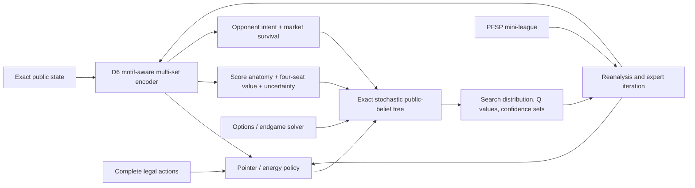

# State-of-the-Art Research Agenda for 100+ Mean

Date: 2026-06-16

Ruleset: four-player AAAAA, no habitat bonuses

Compute boundary: john1, john2, john3, and john4; local Apple Silicon only

## Executive Conclusion

The current qualified player scores **95.744** over 1,000 held-out games, leaving
a measured **4.256-point gap** to 100. The evidence does not support trying to
close that gap with another scalar ranker, another modest rollout increase, or
another hand-tuned search allocator.

The most credible route is a new integrated system:

> **CascadiaZero: a relational complete-action policy and decomposed value model,
> improved by exact stochastic public-belief search, continual reanalysis, and
> opponent-population self-play.**

The exact Rust simulator should remain authoritative. MLX should perform batched
policy, value, uncertainty, and opponent-model inference. The system should
learn to propose and rank complete legal turns, search one or more real table
rotations through explicit chance and opponent nodes, and distill the complete
search distribution back into the model.

The top six directions below are therefore not competing ideas. They are the
parts of one self-improving architecture. Directions 7 through 12 are
orthogonal mechanisms that could supply the remaining points once the core
loop works.

## What The Repository Evidence Says

The current benchmark and research history sharply constrain the useful search
space:

- The canonical qualified mean is **95.744**, with a 95% interval of
  `[95.652, 95.837]`. See
  [final strength validation](final-strength-validation.md).
- The champion gains heavily in Habitat and Bear, but trails the canonical V2
  control in Elk by 1.262 and Hawk by 0.815. The remaining weakness is not
  generic scoring. It is cross-turn allocation among incompatible spatial
  plans.
- The full-legal audit attributes **0.254 points per decision** to proposal
  frontier regret and **0.095** to within-frontier selection. Top-64 recall is
  only 89.904%. See
  [full-legal decision regret audit](full-legal-decision-regret-audit-v1.md).
- The K32/R600 teacher identifies a statistically distinguishable winner at
  95% confidence in only **18.359%** of validation decisions. The average 95%
  confidence set contains **10.140 actions**. Exact top-one imitation is the
  wrong target. See
  [teacher identifiability](mce-teacher-identifiability.md).
- Open-loop tree sharing by candidate rank was score-neutral and conflated
  materially different future public states. A future tree must be keyed by
  complete public state, not rank. See
  [ADR 0067](../decisions/0067-public-focal-open-loop-tree.md).
- Common random numbers did not improve the same-budget R600 player. Variance
  reduction must be measured and selective, not assumed. See
  [CRN confirmation](common-random-number-sequential-halving-confirmation.md).
- The historical step-function gain came from richer opponent features. That
  is strong evidence that representation and opponent interaction remain more
  promising than isolated search-time heuristics.
- The exact performance campaign has already cleared the 10x single-machine
  target. Further systems work should be attached to a measured research
  bottleneck, not pursued as an end in itself. See
  [PLAN_TO_100.md](../PLAN_TO_100.md).

## Lessons From Other Game Engines

1. **AlphaZero and Expert Iteration:** search is a policy-improvement operator,
   not merely an evaluator. The improved search policy must be distilled back
   into the network so strength compounds.
2. **KataGo:** dense auxiliary supervision, score distributions, opponent move
   prediction, target pruning, and randomized search budgets can reduce the
   compute required for self-play learning by orders of magnitude.
3. **Gumbel AlphaZero and Sampled MuZero:** large action spaces can be handled
   with principled sampling without replacement and completed-Q policy targets.
   This is materially different from adding noise to raw score rankings.
4. **Stochastic MuZero:** afterstates and chance nodes are the right structural
   decomposition for stochastic games. Cascadia should use this structure with
   the exact simulator, not learn rules it already knows.
5. **ReBeL, Student of Games, POMCP, and POMCPOW:** search should operate on a
   public belief or observation history and reroot after new information. Their
   two-player zero-sum guarantees do not transfer, but their state and search
   decompositions do.
6. **AlphaStar and PSRO:** a population exposes blind spots that homogeneous
   self-play hides. Matchmaking should target measured weaknesses rather than
   sample old checkpoints uniformly.
7. **OptionZero:** learned closed-loop temporal options can increase effective
   planning depth under a fixed simulation budget.
8. **Stockfish NNUE:** incremental state updates, exact transposition keys, and
   aggressive reuse make sophisticated evaluation practical. Literal
   alpha-beta pruning does not transfer to stochastic four-player Cascadia.
9. **Graphormer and Set Transformer:** structural attention and
   permutation-aware set processing are a better match for boards, opponents,
   markets, and variable legal-action sets than a flat feature vector.
10. **Distributional RL and value-of-computation search:** uncertainty should
    decide where simulation is spent. It should not silently change the
    objective from expected score to risk aversion.

## Ranked Directions

The upside ranges below are engineering priors for Cascadia, not claims from the
cited papers. They are non-additive.

| Rank | Direction | Credible role | Non-additive upside prior |
|---:|---|---|---:|
| 1 | D6 motif-aware complete-action model | Remove the proposal and relational representation ceiling | +1.0 to +2.5 |
| 2 | KataGo-style score anatomy | Repair sparse credit and leaf-value error | +0.7 to +2.0 |
| 3 | Exact stochastic public-belief tree | Plan through refill and opponent response across turns | +0.5 to +1.5 |
| 4 | Continual expert iteration and reanalysis | Make each search improvement compound | +1.0 to +3.0 over iterations |
| 5 | Opponent-intent and market-survival belief | Exploit the only historically proven feature axis | +0.4 to +1.2 |
| 6 | True Gumbel sampled-action improvement | Learn and search large action sets efficiently | +0.1 to +0.6, or 3x-5x cheaper labels |
| 7 | Learned strategic options and plan slots | Commit to multi-turn Elk, Salmon, Hawk, and habitat plans | +0.4 to +1.2 |
| 8 | Score-aware AlphaStar mini-league | Find and repair policy-specific blind spots | +0.3 to +0.9 |
| 9 | Uncertainty-aware multifidelity teacher | Produce more trustworthy labels per CPU-hour | +0.2 to +0.7, or 2x-5x teacher throughput |
| 10 | Neural-guided exact endgame solver | Convert late-game tactical headroom into certain score | +0.3 to +0.8 |
| 11 | Public-role welfare self-play | Reduce homogeneous-table resource cannibalization | +0.4 to +1.1 |
| 12 | Direct-score evolution strategies | Bypass surrogate-loss mismatch | 0.0 to +1.5, high variance |

## 1. D6 Motif-Aware Complete-Action Model

### Hypothesis

The next breakthrough requires a model that jointly understands hex geometry,
wildlife scoring motifs, opponents, the market, and each complete legal action.
Pointwise factor rankers and generic graph encoders discard exactly the
interactions that determine the best move.

### Design

- Encode occupied and frontier hexes with six directional edge types.
- Enforce the 12 rotations and reflections of the hex lattice through D6 weight
  sharing or exact equivariant augmentation.
- Add explicit motif tokens or hyperedges for Elk lines, Salmon paths, Hawk
  isolation neighborhoods, Bear components, Fox neighborhoods, habitat
  components, and habitat frontiers.
- Treat self board, each opponent board, market pairs, remaining supply, and
  legal actions as typed sets.
- Encode every complete action as a token containing prelude, market choice,
  tile coordinate and orientation, wildlife destination, and exact local
  afterstate deltas.
- Let action tokens cross-attend to the state and to sibling actions, then
  produce a masked listwise distribution over only legal actions.
- Use an autoregressive policy only for proposal:
  `prelude -> market pair -> tile placement -> wildlife placement`.
  Rescore complete actions jointly before selection.

### Why Prior Failures Do Not Close It

The failed local models either pooled candidate context too early, scored
factors independently, used pointwise targets, or relied on generic message
passing. This design preserves complete action identity, explicit scoring
motifs, sibling context, structural biases, and board symmetry through the
final score.

### Cheap Falsification

Train four frozen-data ablations:

1. exact-action pointer baseline;
2. D6 geometry only;
3. motif hypergraph only;
4. D6 plus motifs plus opponent-market attention.

Require D6 consistency, strong motif-count prediction, validation confidence-set
mass, top-64 recall above 98%, and retained R4800 regret below 0.15 before any
gameplay.

### Promotion Gate

The first online pilot must beat the current proposal at equal R600 search
budget by at least +0.50 paired mean over 100 fresh games before confirmation.

### Local Feasibility

A 4M-8M parameter model with `d_model=192`, 4-6 attention blocks, and padded
legal-action tensors is practical in MLX. The exact simulator continues to own
legality and afterstate construction.

### Primary Precedents

- [Graphormer](https://proceedings.neurips.cc/paper/2021/hash/f1c1592588411002af340cbaedd6fc33-Abstract.html)
- [Set Transformer](https://proceedings.mlr.press/v97/lee19d.html)
- [Group Equivariant CNNs](https://proceedings.mlr.press/v48/cohenc16.html)
- [HexaConv](https://arxiv.org/abs/1803.02108)
- [Pointer Networks](https://papers.nips.cc/paper/5866-pointer-networks)
- [Sampled MuZero](https://arxiv.org/abs/2104.06303)

## 2. KataGo-Style Score Anatomy

### Hypothesis

One scalar remaining-score target provides too little credit assignment for a
game whose score is an exact sum of distinct spatial objectives. The network
should learn the anatomy of the score and the probability that unfinished
structures become valuable.

### Design

Use a shared trunk with mutually consistent heads for:

- total remaining score and final total score distribution;
- Bear, Elk, Salmon, Hawk, Fox, habitat, and Nature Token returns;
- each terrain's eventual largest habitat;
- per-motif completion probability, expected final size, and turns to
  completion;
- one-turn, one-table-rotation, and terminal values;
- all four players' score vectors;
- aleatoric score quantiles and epistemic prediction error.

Train exact component targets from completed games and counterfactual action
targets from search. Add a consistency loss requiring component means to sum to
the total mean.

### Why Prior Failures Do Not Close It

The prior tile-marginal target improved Salmon while damaging total score. That
was a replacement objective. This proposal keeps total score primary and uses
components as auxiliary constraints, as KataGo used ownership and score targets
to improve a single final policy.

### Cheap Falsification

On a fixed corpus, compare scalar-only and score-anatomy trunks under identical
capacity and optimizer budgets. Require improved total-value calibration,
component calibration, and action-distribution quality. A component head that
predicts well but does not improve decisions is not sufficient.

### Promotion Gate

At equal proposal and search settings, require a positive paired score interval
and no material regression in any two of Elk, Salmon, and Hawk.

### Primary Precedents

- [KataGo](https://arxiv.org/abs/1902.10565)
- [Distributional RL](https://arxiv.org/abs/1707.06887)
- [Implicit Quantile Networks](https://proceedings.mlr.press/v80/dabney18a.html)

## 3. Exact Stochastic Public-Belief Tree

### Hypothesis

Root MCE cannot fully value a draft whose purpose is to alter the market and
survive three opponent turns. The planner must explicitly represent the
sequence from the focal move through refill, opponent decisions, and the next
focal turn.

### Design

Build a graph with four node types:

1. player decision;
2. deterministic action afterstate;
3. exact or sampled chance refill;
4. public observation and reroot.

Back up a four-seat score vector. At a player node, that player maximizes its
own component or follows a calibrated opponent policy. Never model opponents as
minimizing the focal player. Key every node by the complete public
belief-sufficient state, not by candidate rank. Preserve and reroot the graph
after real actions and refills.

Start with one complete table rotation. Use policy-guided double progressive
widening for opponent actions and chance outcomes. Treat known wildlife counts
exactly and sample only genuinely hidden tile information.

### Why Prior Failures Do Not Close It

ADR 0067 shared future nodes by deterministic candidate rank. That abstraction
merged unlike boards and markets. This direction shares only identical public
states and uses explicit afterstate and chance structure.

### Cheap Falsification

On 200 frozen middle- and late-game states, compare root MCE and one-rotation
search at matched wall time against an R4800 or larger offline reference. Record
regret, tree reuse, observation branching, and leaf-value error separately.

### Promotion Gate

Require lower frozen-state regret, at least 10% realized subtree reuse, and
+0.50 paired mean over 100 games at an acceptable latency before deeper search.

### Primary Precedents

- [Stochastic MuZero](https://openreview.net/forum?id=X6D9bAHhBQ1)
- [POMCP](https://papers.nips.cc/paper/4031-monte-carlo-planning-in-large-pomdps)
- [POMCPOW](https://arxiv.org/abs/1709.06196)
- [ReBeL](https://proceedings.neurips.cc/paper/2020/hash/c61f571dbd2fb949d3fe5ae1608dd48b-Abstract.html)
- [Student of Games](https://arxiv.org/abs/2112.03178)

## 4. Continual Expert Iteration And Reanalysis

### Hypothesis

The repository repeatedly pays for strong search labels and then loses most of
their information in a one-shot classifier or selected-action target. A
continual search-generalization loop should make expensive planning gains
accumulate.

### Design

Store, for every searched decision:

- full observable state and supply belief;
- all legal action hashes and policy logits;
- search visit allocation, Q mean, Q uncertainty, and confidence-set
  membership;
- four-player return vector and exact score decomposition;
- selected action, search version, model version, and simulator identity.

Train the policy toward the complete improved distribution, not a one-hot
winner. Regularly reanalyze high-regret, high-uncertainty, early-game, and
model-disagreement states with the newest search. Use randomized search budgets
and policy-target pruning so cheap exploratory searches do not teach their own
noise.

### Why Prior Failures Do Not Close It

Past distillations were largely one generation and often optimized exact
top-one recovery from an unidentifiable teacher. Expert Iteration requires a
repeated cycle in which a stronger policy improves search and stronger search
then improves the policy.

### Cheap Falsification

Run exactly two iterations on a bounded open seed domain. Each iteration must
improve both the searchless policy and the same-budget searched player. If the
second iteration only fits training loss, stop.

### Promotion Gate

Require monotonic paired improvement across two generations and a positive
held-out interval for the final searched player.

### Primary Precedents

- [Expert Iteration](https://arxiv.org/abs/1705.08439)
- [AlphaZero](https://arxiv.org/abs/1712.01815)
- [KataGo](https://arxiv.org/abs/1902.10565)
- [MuZero Reanalyse](https://papers.neurips.cc/paper_files/paper/2021/hash/e8258e5140317ff36c7f8225a3bf9590-Abstract.html)

## 5. Opponent-Intent And Market-Survival Belief

### Hypothesis

Static opponent counts are useful but incomplete. The agent needs a posterior
over what each opponent is trying to build and therefore which market items are
likely to disappear before the focal player's next turn.

### Design

- Maintain one latent intent state per opponent, updated from board changes,
  recent drafts, token use, and market context.
- Predict each opponent's next wildlife demand, tile habitat demand, market
  choice, token action, and strategy-switch probability.
- Predict the joint survival probability of every current market pair through
  the next table rotation.
- Feed opponent-action distributions into public-belief search and feed
  opponent-market cross-attention into the proposal model.
- Hold policy identity out of observable inputs. The model must infer behavior,
  not memorize checkpoint names.

### Why Prior Failures Do Not Close It

The prior scalar opponent-conditioned market model compressed three opponents
and four market pairs too aggressively. The v4-opp gain showed that detailed
opponent state is valuable. This direction learns a full predictive posterior
and uses it both for proposal and simulation.

### Cheap Falsification

Create policy-held-out next-pick and market-survival datasets. Require calibrated
probabilities and improved counterfactual action ranking on unseen opponent
policies before gameplay.

### Promotion Gate

Require a positive score interval against both homogeneous champion opponents
and a mixed opponent population. Reject identity-specific gains.

### Primary Precedents

- [Opponent Modeling in Deep RL](https://proceedings.mlr.press/v48/he16.html)
- [Self Other-Modeling](https://proceedings.mlr.press/v80/raileanu18a.html)
- [Actor-Attention-Critic](https://proceedings.mlr.press/v97/iqbal19a.html)
- [AlphaStar](https://www.nature.com/articles/s41586-019-1724-z)

## 6. True Gumbel Sampled-Action Policy Improvement

### Hypothesis

Once a useful full-action policy exists, principled sampling without replacement
can spend far fewer simulations while still producing a valid policy-improvement
target.

### Design

- Sample complete legal actions from calibrated policy logits without
  replacement.
- Use the same Gumbel sample throughout root sequential halving.
- Normalize Cascadia-scale Q values through the published monotonic transform.
- Complete unvisited actions from the value estimate.
- Train toward the completed-Q improved policy distribution.
- Keep evaluation deterministic unless stochastic play is an explicit
  experiment.

### Why Prior Failures Do Not Close It

The repository's negative Gumbel experiment perturbed raw score rankings. The
published algorithm is a coupled policy-improvement system involving logits,
without-replacement sampling, completed Q values, and a full target
distribution. These are different hypotheses.

### Cheap Falsification

With a frozen useful policy, test R64 and R128 Gumbel searches against R600
confidence-set mass and paired action regret. Do not test Gumbel before the
policy prior clears its offline gate.

### Promotion Gate

Either preserve canonical strength at at least 3x lower search cost or improve
strength at equal wall time.

### Primary Precedents

- [Gumbel AlphaZero and MuZero](https://openreview.net/forum?id=bERaNdoegnO)
- [Sampled MuZero](https://arxiv.org/abs/2104.06303)

## 7. Learned Strategic Options And Plan Slots

### Hypothesis

Elk lines, Salmon runs, Hawk spacing, and habitat corridors require commitments
that span several focal turns. Primitive-action search repeatedly rediscovers
the same intention and often abandons it too early.

### Design

- Add persistent latent plan slots for Bear, Elk, Salmon, Hawk, Fox, habitat,
  token use, and one flexible slot.
- Predict each plan's target structure, expected score, required resources,
  time-to-completion, and invalidation probability.
- Learn closed-loop options that choose primitive actions until a learned
  termination condition fires.
- Permit search to expand either a primitive action or an option, increasing
  effective depth at the same simulation count.
- Use successor-feature-style vector returns so policies can specialize in
  different score-component tradeoffs and still be combined by generalized
  policy improvement.

### Why Prior Failures Do Not Close It

Fixed ROI weights and handcrafted strategy commitments cannot react when a
market changes. Learned options are conditional policies with learned
termination, not fixed score weights or action sequences.

### Cheap Falsification

First train plan slots only as auxiliary predictors. Require stable intent
states, accurate completion forecasts, and improved Elk/Salmon/Hawk action
ranking. Then test option search on frozen states before full games.

### Promotion Gate

Require a positive total-score interval and a combined Elk+Salmon+Hawk gain
without compensating Bear or habitat collapse.

### Primary Precedents

- [OptionZero](https://openreview.net/forum?id=3IFRygQKGL)
- [Option-Critic](https://arxiv.org/abs/1609.05140)
- [Successor Features and Generalized Policy Improvement](https://arxiv.org/abs/1606.05312)

## 8. Score-Aware AlphaStar Mini-League

### Hypothesis

Uniform sampling from historical checkpoints does not target the lineups that
expose the champion's strategic weaknesses. A small measured league can create
better training opponents without chasing equilibrium for its own sake.

### Design

Maintain:

- one main policy;
- one current-main exploiter;
- one historical league exploiter;
- specialist policies for scarcity, denial, pattern commitment, token spending,
  and conservative play.

Build a seat-balanced empirical payoff table using raw focal score, all-seat
mean, score components, and uncertainty. Matchmake approximately 30%
homogeneous current policy, 50% hard score-deficit profiles, 10% forgetting
sentinels, and 10% uniform exploration. Admit an exploiter only when it reveals
a novel payoff weakness and remains individually competent.

### Why Prior Failures Do Not Close It

The repository's historical FSP is a uniformly sampled checkpoint reservoir.
It has no payoff table, targeted best response, learning-progress scheduler,
meta-strategy, or forgetting test.

### Cheap Falsification

Create a six-policy lineup table with balanced seat rotations, then run one
equal-budget PFSP iteration against one uniform-pool iteration.

### Promotion Gate

Require stronger homogeneous mean score, no forgetting against historical
sentinels, and improved mixed-population robustness.

### Primary Precedents

- [PSRO](https://arxiv.org/abs/1711.00832)
- [Fictitious Self-Play](https://proceedings.mlr.press/v37/heinrich15.html)
- [AlphaStar](https://www.nature.com/articles/s41586-019-1724-z)
- [Open-Ended Learning](https://proceedings.mlr.press/v97/balduzzi19a.html)

## 9. Uncertainty-Aware Multifidelity Teacher

### Hypothesis

The R600 teacher spends too much compute trying to distinguish near-ties and
still emits an unstable top-one label. Simulation should be allocated according
to expected decision value, and cheap correlated estimates should be combined
with occasional exact terminal rollouts without bias.

### Design

- Predict return quantiles and epistemic uncertainty for each action.
- Replace fixed halving with leader-versus-ambiguous-challenger allocation and
  an anytime stopping rule.
- Estimate the value of another rollout batch before spending it.
- Couple a cheap learned or truncated estimate with exact terminal samples using
  an unbiased control-variate or multifidelity correction.
- Use measured covariance to decide when paired random futures help. Default to
  independent streams when they do not.
- Preserve expected score as the action objective. Uncertainty controls compute,
  not risk preference.

### Why Prior Failures Do Not Close It

Same-budget blanket CRN failed. This proposal first measures estimator
correlation, uses an unbiased correction, and allocates compute per decision.
It does not assume every action pair benefits from shared randomness.

### Cheap Falsification

Measure low/high estimator correlation by phase and action type. Continue only
if correlation is high enough to support at least a 2x effective sample gain.
Then compare confidence-set recovery and wall time on frozen decisions.

### Promotion Gate

Require equal or better canonical strength with at least 2x teacher throughput,
or a clear strength gain at equal total compute.

### Primary Precedents

- [Track-and-Stop](https://proceedings.mlr.press/v49/garivier16a.html)
- [Value of Computation in MCTS](https://proceedings.mlr.press/v124/sezener20a.html)
- [Uncertainty-Propagating MCTS](https://proceedings.mlr.press/v267/dam25c.html)
- [Prioritized Experience Replay](https://arxiv.org/abs/1511.05952)

## 10. Neural-Guided Exact Endgame Solver

### Hypothesis

Late-game decisions have fewer hidden futures, higher teacher identifiability,
and more exactly bounded scoring consequences. An exact or near-exact solver
for the final 3-5 focal turns can capture points that noisy rollouts leave on
the table.

### Design

- Derive admissible upper bounds from turns remaining, wildlife supply, legal
  placement capacity, maximum Card A increments, habitat component growth, and
  token constraints.
- Use the neural policy only for branch ordering.
- Prune only with valid mathematical bounds.
- Enumerate exact wildlife chance where tractable and use stratified tile-world
  samples where hidden tile state remains too large.
- Cache exact local pattern subproblems and canonical public states.

### Why Prior Failures Do Not Close It

Prior deterministic lookahead and shallow beams used heuristic values and noisy
pruning. This direction is phase-limited, bound-driven, and exact where it
claims exactness.

### Cheap Falsification

Build bounds without a solver and measure their tightness on 1,000 late-game
states. Stop if they prune too little. If useful, compare a 3-turn solver with
a massive-rollout reference.

### Promotion Gate

Require lower late-state regret and +0.30 paired full-game mean before extending
the horizon.

### Primary Precedents

- [BAST](https://arxiv.org/abs/1408.2028)
- [Policy-Guided Heuristic Search](https://arxiv.org/abs/2103.11505)
- [Stockfish NNUE principles](https://official-stockfish.github.io/docs/nnue-pytorch-wiki/docs/nnue.html)

## 11. Public-Role Welfare Self-Play

### Hypothesis

The benchmark places the same frozen player in all four seats and measures
their mean. Purely selfish homogeneous self-play may cause all four copies to
chase the same scarce resources. A shared policy can learn complementary public
roles while still using identical weights in every seat.

### Design

- Add four public role embeddings, randomly permuted across seats every game.
- Train a single shared policy with utility
  `U_i = (1 - lambda) * own_score + lambda * table_mean`.
- Sweep a small preregistered `lambda` set including zero.
- Let roles specialize in complementary resource demand, not hidden
  communication.
- Evaluate the frozen shared policy both homogeneously and among unrelated
  opponent policies.

### Why This Is A Separate Track

This is the most benchmark-specific direction. It may raise homogeneous table
mean while reducing general opponent robustness. It should remain separate
from the main superhuman-player claim unless it also passes mixed-opponent
evaluation.

### Cheap Falsification

Use equal initial weights and data budgets for `lambda = 0, 0.05, 0.10, 0.20`.
Measure role specialization, table mean, focal mean, and mixed-opponent score.

### Promotion Gate

Require a homogeneous gain without a material mixed-opponent regression. If it
only learns collusive specialization, report it as a benchmark optimizer rather
than the canonical player.

### Primary Precedents

- [JPSRO for n-player general-sum games](https://proceedings.mlr.press/v139/marris21a.html)
- [Actor-Attention-Critic](https://proceedings.mlr.press/v97/iqbal19a.html)
- [AlphaStar](https://www.nature.com/articles/s41586-019-1724-z)

## 12. Direct-Score Evolution Strategies

### Hypothesis

The repository has repeatedly improved surrogate losses without improving
score. Directly optimizing the canonical episode score may find useful policy
or search changes that supervised losses miss.

### Design

- Freeze the main relational trunk.
- Expose only a small adapter, mixture gate, option gate, or policy-temperature
  parameter vector to black-box optimization.
- Use antithetic perturbations, paired seeds, balanced seats, and common initial
  states.
- Evaluate different perturbations in parallel across the four Macs.
- Optimize mean base score directly, while retaining held-out seed domains for
  promotion.

Do not apply evolution strategies to the full multi-million-parameter model
first. The local sample budget is better suited to low-rank adapters or a
compact strategic controller.

### Why Prior Failures Do Not Close It

This does not rely on the noisy MCE top-one teacher or assume that a lower
ranking loss implies a stronger player. It attacks the actual objective.

### Cheap Falsification

Run a low-dimensional adapter pilot with synthetic known optima and then a
small paired canonical-score campaign. Require consistent gradient signal
across seed blocks before scaling.

### Promotion Gate

Require a held-out paired gain with a positive interval and no evidence that
the optimizer memorized a seed family.

### Primary Precedents

- [AlphaZeroES](https://arxiv.org/abs/2406.08687)
- [Evolution Strategies as a Scalable Alternative for Reinforcement Learning](https://arxiv.org/abs/1703.03864)

## Recommended Integrated Architecture

Rust remains authoritative for:

- rules, legality, scoring, apply/undo, state hashing, chance generation, tree
  bookkeeping, and exact endgame bounds.

MLX owns:

- board and action encoding;
- policy, value, component, quantile, opponent, and option heads;
- batched leaf inference;
- training, reanalysis fitting, and adapter optimization.

Stockfish-style incremental accumulators and exact transposition keys should be
implemented as enabling infrastructure inside this architecture, not treated
as independent strength hypotheses.

## First Research Campaign

The highest-value first campaign is an offline architecture tournament for
Directions 1 and 2. It directly attacks the dominant proposal regret and the
historically proven representation bottleneck without paying for a new gameplay
campaign before the model demonstrates basic sufficiency.

Suggested nonduplicative cluster allocation:

| Host | Independent hypothesis |
|---|---|
| john1 | Exact-action pointer baseline plus score-anatomy heads |
| john2 | D6 equivariant geometry ablation |
| john3 | Motif-hypergraph ablation |
| john4 | D6 + motifs + opponent-market multi-set attention |

All four arms should use identical frozen data, capacity bands, optimizer
budgets, and decision-level soft targets. The winning representation then
becomes the policy/value model for the one-table-rotation search prototype.

In parallel, complete the already preregistered ADR 0120 and ADR 0126 work.
Those experiments are useful closure evidence for the current hierarchical
ranker family, but they should not be allowed to turn into another open-ended
pointwise-ranker sweep.

## Recommended Order

1. Build and falsify Directions 1 and 2 together.
2. Add Direction 5 as an auxiliary predictive task.
3. Build the one-table-rotation version of Direction 3.
4. Integrate Direction 6 and start Direction 4's two-generation loop.
5. Add Direction 8 once a competent policy exists.
6. Use Direction 9 to increase the rate of trustworthy reanalysis.
7. Add Directions 7 and 10 as orthogonal planning extensions.
8. Run Directions 11 and 12 as clearly labeled high-upside research tracks.

## Explicitly Deprioritized

- A learned MuZero transition model. Cascadia already has an exact, fast
  simulator; learned dynamics add model error without solving the measured
  bottleneck.
- Literal alpha-beta, null-move pruning, or opponent minimization. Their
  correctness assumptions do not hold in stochastic four-player general-sum
  play.
- Literal CFR or ReBeL equilibrium optimization. Their strongest guarantees are
  for two-player zero-sum games.
- Another raw Gumbel-noise rank perturbation.
- Another generic increase in R600 rollout count or candidate width.
- Another scalar value head trained from one terminal score.
- Another fixed wildlife ROI vector.
- Another open-loop tree keyed by candidate rank.
- A large league before a useful learned policy exists.

## Primary Source Index

### Search And Policy Improvement

- [AlphaZero](https://arxiv.org/abs/1712.01815)
- [Expert Iteration](https://arxiv.org/abs/1705.08439)
- [KataGo](https://arxiv.org/abs/1902.10565)
- [Gumbel AlphaZero and MuZero](https://openreview.net/forum?id=bERaNdoegnO)
- [Sampled MuZero](https://arxiv.org/abs/2104.06303)
- [Stochastic MuZero](https://openreview.net/forum?id=X6D9bAHhBQ1)
- [MuZero Reanalyse](https://papers.neurips.cc/paper_files/paper/2021/hash/e8258e5140317ff36c7f8225a3bf9590-Abstract.html)
- [OptionZero](https://openreview.net/forum?id=3IFRygQKGL)

### Multiplayer And Public Belief

- [Student of Games](https://arxiv.org/abs/2112.03178)
- [ReBeL](https://proceedings.neurips.cc/paper/2020/hash/c61f571dbd2fb949d3fe5ae1608dd48b-Abstract.html)
- [POMCP](https://papers.nips.cc/paper/4031-monte-carlo-planning-in-large-pomdps)
- [POMCPOW](https://arxiv.org/abs/1709.06196)
- [Fictitious Self-Play](https://proceedings.mlr.press/v37/heinrich15.html)
- [PSRO](https://arxiv.org/abs/1711.00832)
- [AlphaStar](https://www.nature.com/articles/s41586-019-1724-z)
- [JPSRO](https://proceedings.mlr.press/v139/marris21a.html)

### Representation And Structured Actions

- [Graphormer](https://proceedings.neurips.cc/paper/2021/hash/f1c1592588411002af340cbaedd6fc33-Abstract.html)
- [Set Transformer](https://proceedings.mlr.press/v97/lee19d.html)
- [Group Equivariant CNNs](https://proceedings.mlr.press/v48/cohenc16.html)
- [HexaConv](https://arxiv.org/abs/1803.02108)
- [Pointer Networks](https://papers.nips.cc/paper/5866-pointer-networks)
- [Successor Features](https://arxiv.org/abs/1606.05312)

### Statistical Efficiency And Direct Optimization

- [Implicit Quantile Networks](https://proceedings.mlr.press/v80/dabney18a.html)
- [Track-and-Stop](https://proceedings.mlr.press/v49/garivier16a.html)
- [Value of Computation in MCTS](https://proceedings.mlr.press/v124/sezener20a.html)
- [Uncertainty-Propagating MCTS](https://proceedings.mlr.press/v267/dam25c.html)
- [Stockfish NNUE](https://official-stockfish.github.io/docs/nnue-pytorch-wiki/docs/nnue.html)
- [AlphaZeroES](https://arxiv.org/abs/2406.08687)
